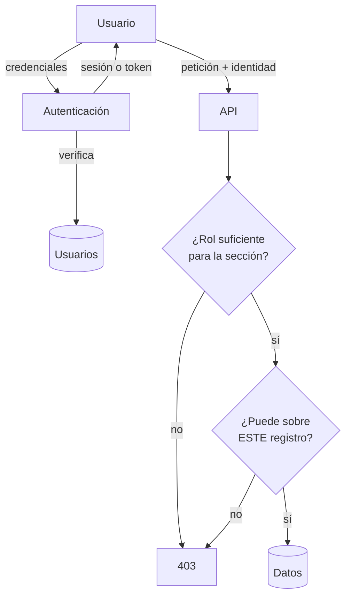

# Caso 1 · Autenticación y permisos { .section-fundamentos }

> **Enunciado.** «Tenemos una aplicación interna de gestión. Hay comerciales, administrativos y responsables. Cada uno debe ver solo lo que le corresponde: un comercial ve sus clientes, un responsable los de todo su equipo. Diséñalo.»

---

## Lo que preguntarías primero {: .topic-title }

Antes de dibujar nada:

1. **¿Los usuarios ya existen en algún sitio?** ¿Hay un directorio corporativo, o los gestionamos nosotros? Cambia por completo la pieza de autenticación.
2. **¿Los permisos dependen solo del cargo, o también del dato?** «Un comercial ve clientes» es un rol. «Un comercial ve *sus* clientes» ya no.
3. **¿Hay aplicación móvil o solo web?** Decide entre sesión con cookie y token.
4. **¿Un usuario puede pertenecer a varios equipos?** Cambia el modelo de datos.
5. **¿Los permisos cambian a menudo?** Si los administra un responsable desde la interfaz, no pueden estar escritos en el código.

!!! tip "La pregunta 2 es la que demuestra que has entendido el problema"
    Es la frontera entre dos modelos distintos, y el enunciado la esconde a propósito. Detectarla es medio ejercicio.

---

## Los dos modelos {: .topic-title }

**RBAC** (control por roles): el permiso depende de **quién eres**. `ROLE_ADMIN` puede entrar en administración.

**ABAC** (control por atributos): el permiso depende de **quién eres y de las propiedades del dato**. Puedes editar este cliente porque su comercial asignado eres tú.

| | RBAC | ABAC |
|---|---|---|
| Pregunta que responde | ¿Qué eres? | ¿Qué relación tienes con *esto*? |
| Se guarda en | Una lista de roles del usuario | La comprobación mira el objeto |
| Sirve para | Secciones enteras de la aplicación | Registros concretos |
| Se rompe cuando | Aparece "solo los suyos" | — |

!!! danger "El error que descarta: inventar roles por cada caso"
    ```
    ROLE_COMERCIAL_ZONA_NORTE
    ROLE_COMERCIAL_CLIENTE_1745
    ```
    En cuanto los permisos dependen del dato, el número de roles crece sin control y hay que cambiarlos cada vez que se reasigna un cliente.

    La frase que quieren oír: **«los roles dicen a qué pantallas entras; una comprobación sobre el objeto dice qué registros puedes tocar»**.

En Symfony esa comprobación es un *voter*; en otros marcos se llama *policy* o *guard*. El nombre cambia, el concepto no.

---

## El diseño {: .topic-title }



Dos comprobaciones **consecutivas**, no alternativas. La primera filtra por sección; la segunda por registro.

### El modelo de datos

```
Usuario ──┬── roles: [ROLE_COMERCIAL]
          └── equipo_id ──> Equipo ──> responsable_id ──> Usuario

Cliente ──── comercial_id ──> Usuario
```

Con esa forma, las dos reglas se responden con una consulta:

- Un comercial ve un cliente si `cliente.comercial_id == usuario.id`.
- Un responsable lo ve si el comercial de ese cliente pertenece a su equipo.

---

## El paso a paso en la pizarra {: .topic-title }

**1.** «Separo dos cosas: **autenticación**, saber quién eres, y **autorización**, saber qué puedes hacer. Son dos preguntas distintas y fallan de forma distinta: la primera da un 401, la segunda un 403.»

**2.** «Para autenticar, dos opciones. Si es solo web interna, **sesión con cookie** marcada `HttpOnly` y `SameSite`. Si hay móvil o la interfaz está separada del backend, **token**. Empezaría por sesión, que es más simple, y solo iría a token si hace falta.»

**3.** «Para autorizar, dos capas. Los **roles** protegen secciones enteras: solo administración entra en la pantalla de configuración. Eso es una regla por ruta.»

**4.** «Y encima, una comprobación **por registro**. Cuando alguien pide el cliente 1745, una función recibe el usuario y ese cliente y responde sí o no. Esa función vive en un solo sitio y la usan la API, la interfaz para decidir si pinta el botón, y cualquier proceso.»

**5.** «Aquí dibujo el modelo: el cliente tiene un comercial asignado; el usuario pertenece a un equipo; el equipo tiene un responsable. Con eso las dos reglas salen solas.»

**6.** «Y ahora lo que puede fallar.»

---

## Qué puede fallar {: .topic-title }

| Riesgo | Cómo lo resuelvo |
|---|---|
| Ocultar el botón y dejar la URL abierta | La comprobación va en el servidor; la interfaz solo la refleja |
| El listado filtra pero el detalle no | La misma función se aplica en los dos sitios |
| Un usuario cambia de equipo | El permiso se evalúa al consultar, no se guarda copiado |
| Alguien prueba identificadores a mano | Devolver 404 en vez de 403 donde no deba saberse que existe |
| Contraseñas comprometidas | Hash con `bcrypt`, límite de intentos, HTTPS obligatorio |
| Sesión robada | Cookie `HttpOnly` + `Secure` + `SameSite`; caducidad corta |

!!! danger "Ocultar el botón NO es proteger la acción"
    Es el fallo que más se ve y el que peor sienta en una prueba técnica. Si la única defensa es un `if` en la plantilla, cualquiera escribe la URL a mano o lanza la petición desde la terminal.

    Dilo tú antes de que te lo pregunten: **«esto lo oculto en la interfaz por comodidad, pero la protección real está en el servidor»**.

---

## Lo que te van a preguntar {: .topic-title }

!!! question "«¿Y si los permisos los quiere administrar un responsable desde la aplicación?»"
    Entonces las reglas no pueden estar en el código: pasan a ser datos. Se añade una tabla de permisos y la comprobación los consulta.

    El precio es una consulta más por comprobación, así que se cachean los permisos del usuario durante la petición. Y hay que invalidar esa caché cuando alguien los cambia.

!!! question "«¿Cómo pruebas que un comercial no ve los clientes de otro?»"
    Con una prueba que **espera un 403**. Comprobar que el propietario entra no demuestra nada; la prueba que protege es la del acceso denegado.

    Es la que casi nadie escribe y la que evita la fuga de datos.

!!! question "«¿Sesión o token? Elige y justifica.»"
    Sesión si el backend sirve las páginas: más simple, y la cookie `HttpOnly` no se puede robar con un ataque de inyección de scripts.

    Token si la interfaz es una aplicación separada o hay móvil. Precio: hay que decidir dónde se guarda —y en `localStorage` es vulnerable a esa inyección—, y añadir renovación porque un token no se puede revocar.

    **Lo que quieren oír es el criterio, no la respuesta.**

!!! question "«¿Qué pasa si el directorio corporativo se cae?»"
    Nadie puede iniciar sesión. Se mitiga cacheando los datos del usuario para las sesiones ya abiertas, y teniendo una cuenta local de emergencia para administración.

    Es el precio de delegar la autenticación: ganas no gestionar contraseñas y pierdes independencia.

---

## Lo que dejo fuera {: .topic-title }

Dilo en voz alta al terminar:

- Recuperación de contraseña y verificación por correo.
- Segundo factor de autenticación.
- Registro de auditoría de quién ha visto qué.
- Suplantación de usuario para dar soporte.

---

## Documentación relacionada {: .topic-title }

| Tema | Dónde |
|---|---|
| Cortafuegos, roles, `access_control` | [Symfony → Seguridad](../../../symfony/02-seguridad/index.md) |
| Permisos que dependen del objeto | [Symfony → Voters](../../../symfony/02-seguridad/05-voters/index.md) |
| Tokens en una API | [Symfony → JWT](../../../symfony/02-seguridad/08-jwt/index.md) |
| Dónde vive el token en el navegador | [JS → Almacenamiento](../../../js/06-almacenamiento/index.md) |
