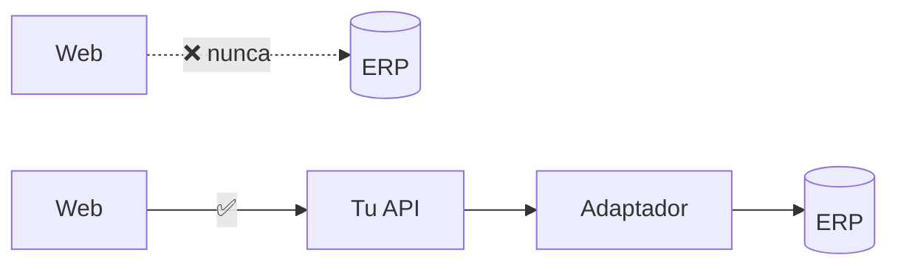
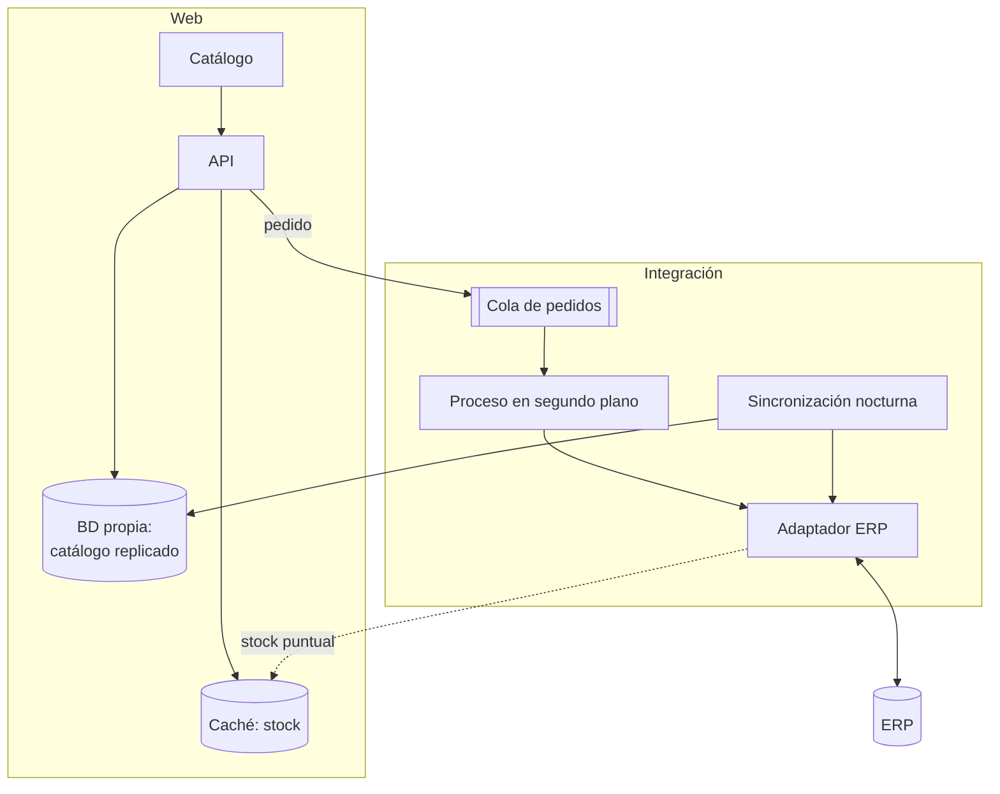

# Caso 2 · Integrar un sistema externo { .section-fundamentos }

> **Enunciado.** «La empresa tiene un ERP donde viven los productos, el stock y los precios. Queremos una web donde los clientes vean el catálogo y hagan pedidos. Diséñalo.»

---

## Lo que preguntarías primero {: .topic-title }

1. **¿Cómo se habla con el ERP?** ¿API REST, servicio SOAP, base de datos directa, ficheros por carpeta compartida? Es lo que más condiciona el diseño.
2. **¿Quién manda sobre cada dato?** El stock lo dice el ERP; la ficha con fotos y descripción quizá la web. Hay que trazar esa frontera.
3. **¿Con qué frecuencia cambia el stock?** ¿Vale un dato de hace diez minutos, o hay que consultarlo en el momento?
4. **¿Cuánto aguanta el ERP?** ¿Se le pueden hacer mil consultas por minuto o se cae?
5. **¿Qué pasa si el ERP está caído?** ¿La web deja de vender, o encola los pedidos?

!!! tip "La pregunta 4 sorprende y es muy real"
    Un ERP suele ser un sistema antiguo, dimensionado para los empleados que trabajan dentro, no para el tráfico de una web pública. Preguntarlo demuestra que has pensado en el sistema real y no solo en tu parte.

---

## La regla de oro {: .topic-title }

**Nada de tu aplicación habla directamente con el ERP.** Todo pasa por una única clase adaptadora que traduce entre su lenguaje y el tuyo.

Tres motivos concretos:

1. **Si el ERP cambia**, tocas un fichero en vez de treinta.
2. **Puedes sustituirlo por un doble** en las pruebas, sin depender de que el ERP esté disponible.
3. **Los reintentos, los tiempos límite y la caché** viven en un solo sitio.

!!! danger "El error que descarta: consultar el ERP en cada petición web"
    Si cada visita al catálogo lanza una llamada al ERP, dos cosas pasan seguro: la web va lentísima —porque su tiempo de respuesta manda sobre el tuyo— y el ERP se satura en cuanto haya algo de tráfico.

    Y lo peor: **si el ERP se cae, tu web se cae con él**. Has acoplado la disponibilidad de tu web a la de un sistema que no controlas.

---

## El diseño {: .topic-title }

La idea central: **tres caminos distintos según qué necesita cada dato.**

| Dato | Estrategia | Por qué |
|---|---|---|
| Catálogo (nombre, descripción, precio) | Copia en tu base de datos, sincronizada cada noche | Cambia poco; la web debe funcionar aunque el ERP no esté |
| Stock | Consulta al ERP con caché corta (1-5 minutos) | Cambia a menudo, pero no hace falta el segundo exacto |
| Pedido | A una cola, y un proceso lo lleva al ERP | El cliente no debe esperar, y si el ERP falla no se pierde |

!!! tip "Esa tabla es la respuesta del ejercicio"
    Si solo dices una frase en toda la prueba, que sea esta: **no todos los datos se integran igual**. Distinguir qué se replica, qué se cachea y qué se encola es exactamente lo que se evalúa.

---

## El paso a paso en la pizarra {: .topic-title }

**1.** «Lo primero: la web **no** habla con el ERP. Pongo un adaptador en medio que es el único que conoce su formato. Todo lo demás habla con mi modelo.»

**2.** «Ahora clasifico los datos por cómo cambian. El catálogo cambia poco: lo **replico** en mi base de datos con una sincronización nocturna. Así la web es rápida y funciona aunque el ERP no responda.»

**3.** «El stock cambia constantemente: no lo replico. Lo consulto al ERP y lo **cacheo unos minutos**. Un cliente que ve un stock de hace tres minutos no es un problema; ya validaré de verdad al confirmar el pedido.»

**4.** «El pedido es el camino crítico. El cliente pulsa "comprar" y yo hago dos cosas: **lo guardo en mi base de datos** y **lo pongo en una cola**. Respondo al cliente enseguida con un "pedido recibido". Un proceso en segundo plano lo lleva al ERP.»

**5.** «Con eso, si el ERP está caído, el cliente sigue pudiendo comprar. El pedido espera en la cola y entra cuando el ERP vuelva.»

**6.** «Y ahora, qué puede fallar.»

---

## Qué puede fallar {: .topic-title }

| Riesgo | Cómo lo resuelvo |
|---|---|
| El ERP no responde a tiempo | Tiempo límite corto (3-5 s) y reintento con espera creciente |
| El ERP está caído del todo | Dejar de llamarlo un rato (**cortocircuito**) y servir lo replicado |
| Un pedido se envía dos veces | **Idempotencia**: identificador único por pedido; el ERP ignora repetidos |
| La sincronización nocturna falla | Alerta, y los datos viejos siguen sirviendo; no se borra nada hasta confirmar |
| Se vende algo sin stock | Validar contra el ERP **al confirmar**, no solo al mostrar |
| El ERP devuelve un formato inesperado | Validar en el adaptador; registrar y no propagar basura al modelo |

!!! danger "La idempotencia es la palabra clave de este caso"
    Todo lo que se reintenta puede ejecutarse dos veces. Si el proceso envía un pedido, el ERP lo recibe, y la respuesta se pierde por un corte de red, el proceso reintentará y creará **un pedido duplicado**.

    La solución: cada pedido lleva un identificador propio y el ERP lo usa como clave. Si ya lo tiene, lo ignora y confirma.

    Decir esto sin que te lo pregunten es una de las cosas que más suben la nota.

!!! warning "El cortocircuito evita el efecto dominó"
    Si el ERP tarda 30 segundos en fallar y le mandas cien peticiones, tienes cien procesos bloqueados esperando. Se agotan las conexiones y **tu web cae por culpa de la suya**.

    El patrón de cortocircuito cuenta los fallos: tras varios seguidos, deja de intentarlo durante un minuto y responde al momento con lo que tenga en caché. Pasado ese tiempo, prueba una vez a ver si ha vuelto.

---

## Lo que te van a preguntar {: .topic-title }

!!! question "«¿Y si el ERP solo permite ficheros CSV por carpeta compartida?»"
    Cambia el adaptador, no el diseño. La sincronización pasa a leer ficheros en vez de llamar a una API, y los pedidos se escriben como ficheros que el ERP recoge.

    Aparece un problema nuevo: saber si el ERP ya ha procesado un fichero. Se resuelve moviéndolos entre carpetas —`pendientes/`, `procesados/`, `error/`— que es el estándar de este tipo de integración.

    **Que el diseño aguante el cambio es la prueba de que el adaptador estaba bien puesto.**

!!! question "«¿Cómo sabe el cliente que su pedido ha entrado en el ERP?»"
    El pedido tiene estados: `recibido` → `enviado al ERP` → `confirmado` / `error`. La web muestra el estado y notifica cuando cambia.

    Es honesto con el cliente y además da al equipo una pantalla donde ver los pedidos atascados.

!!! question "«¿Cada cuánto sincronizas el catálogo? ¿Y si cambia un precio a media mañana?»"
    Nocturna para el grueso, y un mecanismo de aviso para lo urgente: si el ERP puede llamar a una URL tuya al cambiar un precio, se actualiza al momento.

    Si no puede, una sincronización ligera cada hora solo de precios. La conversación de fondo es **cuánto desfase se tolera**, y esa decisión no es técnica: es del negocio.

!!! question "«¿Qué pasa si dos clientes compran la última unidad a la vez?»"
    Se vende dos veces si solo miras el stock cacheado. Por eso la validación real va **al confirmar**, contra el ERP, y en el momento de reservar.

    Si el ERP no ofrece reserva atómica, la alternativa es aceptar el pedido y gestionarlo como incidencia. Es una decisión de negocio: hay comercios que prefieren vender y avisar a rechazar la venta.

---

## Lo que dejo fuera {: .topic-title }

- Pasarela de pago.
- Devoluciones y su reflejo en el ERP.
- Precios distintos por cliente.
- Traducciones del catálogo.

---

## Documentación relacionada {: .topic-title }

| Tema | Dónde |
|---|---|
| Llamar a una API externa con tiempos límite y reintentos | [Symfony → Servicios](../../../symfony/01-servicios/03-llamar-una-api-externa/index.md) |
| Cachear resultados costosos | [Symfony → Servicios](../../../symfony/01-servicios/04-cache/index.md) |
| Comandos de consola para la sincronización | [Symfony → Servicios](../../../symfony/01-servicios/06-comandos-de-consola/index.md) |
| Reintentos y espera exponencial en el cliente | [JS → Capa de API](../../../js/05-asincronia/07-capa-de-api/index.md) |
