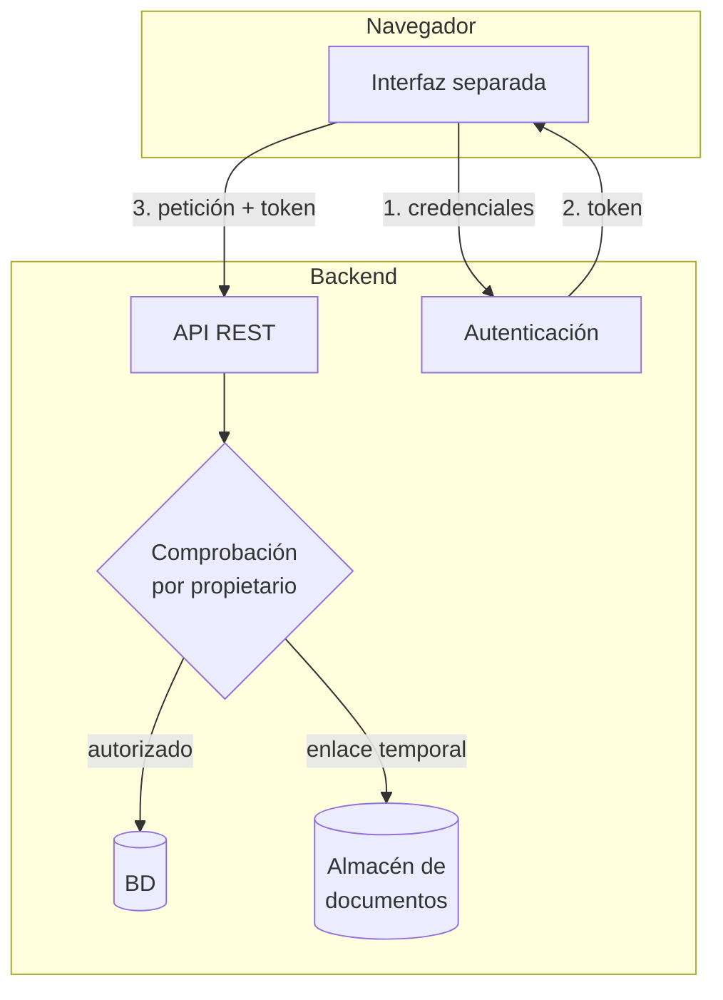

# Caso 3 · Portal de cliente { .section-fundamentos }

> **Enunciado.** «Queremos que cada cliente entre en una web y vea su histórico de pedidos, se descargue sus facturas en PDF y actualice sus datos de contacto. La interfaz la hará el equipo de frontend por separado. Diséñalo.»

---

## Lo que preguntarías primero {: .topic-title }

1. **¿De dónde salen las facturas?** ¿Las genera el ERP y hay que servirlas, o las generamos nosotros?
2. **¿Cuántos pedidos puede tener un cliente?** Diez o diez mil cambia si hace falta paginación y búsqueda.
3. **¿Un usuario puede representar a varias empresas?** Un gestor que lleva tres sociedades rompe el modelo simple.
4. **¿Los datos de contacto se guardan aquí o en el ERP?** Si es en el ERP, actualizarlos es una escritura hacia fuera.
5. **¿Interfaz separada implica otro dominio?** Determina si hay CORS y qué forma tiene la autenticación.

!!! tip "La pregunta 3 es la trampa del enunciado"
    «Cada cliente ve lo suyo» suena a una relación simple entre usuario y cliente. En una empresa real, un usuario puede gestionar varias sociedades y una sociedad tener varios usuarios.

    Detectarlo cambia el modelo de datos, y detectarlo **antes** de dibujarlo es exactamente lo que evalúan.

---

## El diseño {: .topic-title }



Cinco decisiones que hay que justificar:

| Decisión | Motivo |
|---|---|
| API con tokens, sin sesión | La interfaz es una aplicación aparte, posiblemente en otro dominio |
| Comprobación por propietario en **cada** endpoint | El filtro del listado no protege el detalle |
| Los PDF no se sirven desde una carpeta pública | Una URL adivinable expone facturas ajenas |
| Paginación desde el primer día | El histórico crece y nadie lo mira entero |
| Los datos de contacto se validan en el servidor | La interfaz no es una frontera de seguridad |

---

## El paso a paso en la pizarra {: .topic-title }

**1.** «Como la interfaz va aparte, expongo una **API REST** y autentico con **token**. El cliente se identifica una vez, recibe un token corto y lo manda en cada petición.»

**2.** «Modelo los datos: un `Usuario` pertenece a uno o varios `Clientes`; un `Pedido` pertenece a un `Cliente`; una `Factura` pertenece a un `Pedido`. La pertenencia es lo que define el permiso.»

**3.** «Cada endpoint hace **dos** comprobaciones. El listado filtra por los clientes del usuario. Y el detalle, además, comprueba que ese pedido concreto es suyo — porque el listado y el detalle son puertas distintas.»

**4.** «Las facturas no van en una carpeta pública. Cuando el cliente pide una, el backend comprueba el permiso y **genera un enlace temporal** que caduca en unos minutos. El fichero no es accesible por URL directa.»

**5.** «El listado va **paginado** desde el principio, con un tope de tamaño para que nadie pida diez mil registros de golpe.»

**6.** «Y ahora, qué puede fallar.»

---

## El punto crítico: las facturas {: .topic-title }

!!! danger "Servir PDF desde una carpeta pública es una fuga de datos"
    ```
    https://portal.empresa.com/uploads/facturas/factura-2026-0184.pdf
    ```
    Si esa URL funciona sin comprobar nada, cualquiera puede cambiar el número y descargarse las facturas de otros clientes. Con nombres correlativos, se recorren todas en un bucle de dos líneas.

    Y no hace falta ser un atacante: basta con que un buscador indexe una de esas URL.

Las dos formas correctas:

**Servir a través de un controlador**, que comprueba el permiso y devuelve el fichero:

```
GET /api/facturas/184/descargar
→ comprueba que la factura es del cliente del usuario
→ devuelve el PDF con la cabecera de descarga
```

Simple y seguro. El coste es que cada descarga ocupa un proceso de PHP mientras dura.

**Enlaces temporales firmados**, cuando los ficheros están en un almacenamiento externo:

```
→ el backend comprueba el permiso
→ pide al almacén una URL firmada válida 5 minutos
→ el cliente descarga directamente de ahí
```

El fichero no pasa por tu servidor, así que aguanta muchísimo mejor. Es la opción cuando hay volumen.

!!! tip "Di las dos y elige una"
    «Empezaría sirviéndolo desde un controlador porque es más simple y aquí el volumen es bajo; si creciera, pasaría a enlaces firmados.»

    Esa frase demuestra que conoces las dos opciones **y** que sabes elegir según el contexto, que es justo lo que se busca.

---

## Qué puede fallar {: .topic-title }

| Riesgo | Cómo lo resuelvo |
|---|---|
| Alguien prueba `/api/pedidos/1`, `/2`, `/3` | Comprobación por propietario en el detalle, y `404` en vez de `403` |
| El token caduca a media sesión | Token de refresco; la interfaz renueva y reintenta sin molestar |
| El histórico tarda en cargar | Paginación, índices en la base de datos, y solo los campos que se pintan |
| Se actualiza el contacto con datos inválidos | Validación en el servidor; la del navegador es solo comodidad |
| Interfaz y API en dominios distintos | CORS configurado con la lista de orígenes, no con comodín |
| Un usuario deja de representar a un cliente | El permiso se evalúa al consultar, nunca se copia al token |

!!! danger "No metas la lista de clientes dentro del token"
    Tienta, porque ahorra una consulta. Pero un token es válido hasta que caduca: si a un usuario le quitan el acceso a una sociedad, **sigue viéndola** hasta que su token expire.

    En el token va la identidad. Los permisos se consultan en cada petición.

---

## Lo que te van a preguntar {: .topic-title }

!!! question "«¿Por qué API con token y no la web de siempre con sesión?»"
    Porque la interfaz es una aplicación separada, posiblemente en otro dominio, y una cookie de sesión entre dominios distintos obliga a configurar CORS con credenciales y `SameSite=None`, que es más frágil.

    Y si mañana hay aplicación móvil, la API ya sirve tal cual.

    **Si el backend sirviera las páginas, elegiría sesión sin dudar**: es más simple y la cookie `HttpOnly` no se puede robar con una inyección de scripts.

!!! question "«El cliente dice que ve un pedido que no es suyo. ¿Por dónde empiezas?»"
    Primero reproducir: qué usuario, qué pedido, qué endpoint. Luego mirar si ese endpoint tiene la comprobación por propietario, porque el fallo casi siempre es un detalle sin proteger mientras el listado sí lo estaba.

    Y después, una **prueba que espere un 403** para ese caso, para que no vuelva.

!!! question "«¿Cómo evitas que un cliente descargue diez mil facturas en un bucle?»"
    Limitación de peticiones por usuario. Symfony trae un componente para eso, y se aplica a los endpoints caros.

    Además, registro de descargas: quién ha bajado qué y cuándo. En documentos con datos fiscales, ese registro suele ser un requisito legal, no una opción.

!!! question "«¿Y si el cliente quiere el histórico en Excel?»"
    No se genera durante la petición: un histórico grande tarda demasiado y el navegador agota el tiempo de espera.

    Se encola, un proceso genera el fichero y se avisa al cliente por correo o por notificación cuando está listo. Es el mismo patrón que la [importación masiva](../05-importacion-masiva/index.md), al revés.

---

## Lo que dejo fuera {: .topic-title }

- Registro y recuperación de contraseña.
- Notificaciones de cambios de estado del pedido.
- Multi-idioma.
- Accesibilidad de la interfaz.

---

## Documentación relacionada {: .topic-title }

| Tema | Dónde |
|---|---|
| Diseñar la API: serialización, CRUD, errores | [Symfony → API REST](../../../symfony/03-api-rest/index.md) |
| Tokens, refresco y CORS | [Symfony → JWT](../../../symfony/02-seguridad/08-jwt/index.md) |
| Permisos que dependen del registro | [Symfony → Voters](../../../symfony/02-seguridad/05-voters/index.md) |
| Subida y validación de ficheros | [Symfony → Servicios](../../../symfony/01-servicios/02-subida-de-archivos/index.md) |
| Limitar peticiones | [Symfony → Servicios](../../../symfony/01-servicios/07-rate-limiter/index.md) |
| Consumir la API desde el navegador | [JS → Capa de API](../../../js/05-asincronia/07-capa-de-api/index.md) |
