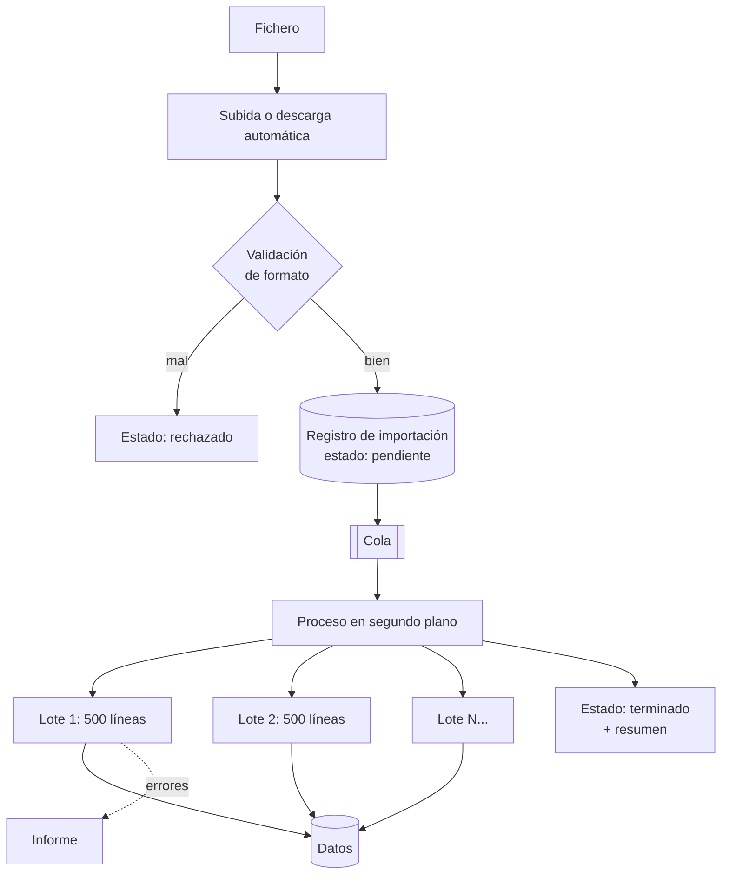

# Caso 5 · Importación masiva { .section-fundamentos }

> **Enunciado.** «Cada mañana recibimos un fichero con 80.000 líneas de tarifas de un proveedor. Hay que cargarlo en el sistema. Ahora se hace a mano y tarda horas. Automatízalo.»

---

## Lo que preguntarías primero {: .topic-title }

1. **¿Cómo llega el fichero?** ¿Correo, carpeta compartida, descarga? Determina el disparador del proceso.
2. **¿Qué pasa si una línea está mal?** ¿Se rechaza el fichero entero o se importan las buenas y se informa del resto?
3. **¿Es sustitución o actualización?** ¿Lo que no viene en el fichero se borra, o se deja como está?
4. **¿Puede llegar el mismo fichero dos veces?** Pasa más de lo que parece.
5. **¿Alguien tiene que aprobar los cambios?** Una subida de precios del 30 % igual no debería aplicarse sola.

!!! tip "La pregunta 2 define el diseño entero"
    «Todo o nada» y «lo que se pueda» son dos arquitecturas distintas.

    Todo o nada significa una transacción enorme que puede bloquear tablas durante minutos. Lo que se pueda significa procesar por lotes y generar un informe de errores.

    En datos de negocio, **casi siempre se quiere «lo que se pueda» más un informe**. Preguntarlo evita construir lo contrario de lo que necesitan.

---

## El error de partida {: .topic-title }

!!! danger "Lo que NO se hace: procesar el fichero durante la petición web"
    ```
    Usuario sube el fichero → el controlador lee 80.000 líneas → guarda → responde
    ```
    Falla por todas partes:

    - **Se agota el tiempo** de la petición. PHP corta a los 30 o 60 segundos.
    - **Se agota la memoria** si se lee el fichero entero en un array.
    - **Si se corta a mitad**, la mitad de los datos están cargados y nadie sabe cuáles.
    - **El navegador se queda colgado** y el usuario pulsa recargar, lanzando una segunda importación en paralelo.

    La respuesta correcta cabe en una frase: **subir y procesar son dos cosas distintas.** La subida es rápida y devuelve un identificador; el proceso ocurre después, en segundo plano.

---

## El diseño {: .topic-title }



Las cuatro piezas:

| Pieza | Responsabilidad |
|---|---|
| **Registro de importación** | Una fila con estado, fecha, fichero y contadores. Es lo que el usuario consulta |
| **Cola** | Desacopla la subida del proceso |
| **Proceso por lotes** | Lee y guarda de 500 en 500, sin cargar todo en memoria |
| **Informe de errores** | Qué línea falló y por qué, descargable |

---

## El paso a paso en la pizarra {: .topic-title }

**1.** «Separo **subir** de **procesar**. La subida guarda el fichero, crea un registro de importación en estado `pendiente` y responde al momento con su identificador. El usuario ve "recibido, procesando".»

**2.** «Antes de encolar, una **validación rápida de formato**: que sea el tipo de fichero esperado, que tenga las columnas previstas, que no esté vacío. Rechazar aquí ahorra tiempo y da un error claro al instante.»

**3.** «Un proceso en segundo plano coge el trabajo de la cola. Lee el fichero **línea a línea**, no entero: con 80.000 líneas, cargarlo en un array agota la memoria.»

**4.** «Proceso **por lotes de 500**. Cada lote es una transacción: valida, guarda y confirma. Si un lote falla, no arrastra a los anteriores.»

**5.** «Las líneas inválidas no detienen el proceso: se anotan en un informe con su número y el motivo. Al final, el registro pasa a `terminado` con el resumen: cuántas bien, cuántas mal, y el informe descargable.»

**6.** «Y ahora, qué puede fallar. Que aquí hay bastante.»

---

## Los tres puntos críticos {: .topic-title }

### Memoria: leer en flujo

```php
$fichero = fopen($ruta, 'r');

while (($linea = fgetcsv($fichero)) !== false) {
    $lote[] = $linea;

    if (count($lote) === 500) {
        $this->procesarLote($lote);
        $lote = [];
    }
}
```

Nunca `file()` ni `file_get_contents()` sobre un fichero grande: cargan el contenido entero en memoria.

!!! warning "Y limpia el gestor de entidades en cada lote"
    Doctrine guarda en memoria todas las entidades que gestiona. Tras 80.000, la memoria se agota igualmente aunque leas en flujo.

    ```php
    $this->em->flush();
    $this->em->clear();     // suelta lo ya guardado
    ```
    Es el fallo clásico de las importaciones en Symfony: se lee bien y aun así se agota la memoria en la línea 40.000.

### Idempotencia: que repetir no duplique

!!! danger "El mismo fichero llega dos veces más a menudo de lo que crees"
    El proveedor lo reenvía, el proceso se reintenta tras un fallo de red, alguien pulsa dos veces. Si el proceso solo inserta, acabas con todo duplicado.

    Dos defensas, y conviene poner las dos:

    1. **Huella del fichero.** Calcula un resumen (`sha256`) del contenido al recibirlo. Si ya existe una importación con esa huella, no lo proceses.
    2. **Insertar o actualizar por clave de negocio.** Cada línea se identifica por su referencia de producto, no por un identificador autonumérico. Si ya existe, se actualiza.

    Con las dos, procesar el mismo fichero cinco veces deja el sistema exactamente igual que procesarlo una. **Eso es idempotencia**, y es la palabra que hay que decir.

### Visibilidad: que se sepa qué ha pasado

| Estado | Significa |
|---|---|
| `pendiente` | Recibido, esperando turno |
| `procesando` | En curso, con contador de progreso |
| `terminado` | Acabado, con resumen |
| `terminado con errores` | Acabado, con líneas rechazadas |
| `fallido` | No se pudo procesar; motivo registrado |

!!! tip "Sin estados, es una caja negra"
    Un proceso en segundo plano sin visibilidad genera la misma pregunta cada mañana: «¿ha entrado el fichero de hoy?». Y no hay forma de responder sin mirar la base de datos.

    Una pantalla con el historial de importaciones y sus estados vale más que cualquier optimización.

---

## Qué puede fallar {: .topic-title }

| Riesgo | Cómo lo resuelvo |
|---|---|
| Fichero enorme | Lectura en flujo, lotes, `clear()` del gestor de entidades |
| El mismo fichero dos veces | Huella del contenido + insertar-o-actualizar por clave de negocio |
| El proceso muere a mitad | Registrar el último lote confirmado y poder reanudar |
| Líneas inválidas | No detienen el proceso; van al informe |
| El fichero llega con otro formato | Validación previa; rechazo con mensaje claro |
| Dos importaciones a la vez | Bloqueo por tipo de importación |
| Una subida de precios absurda | Umbral de alarma: si cambia más del X %, exigir confirmación |

!!! warning "El umbral de alarma es la protección que nadie pide y todo el mundo agradece"
    Si el proveedor envía un fichero con un error de formato y todos los precios salen multiplicados por cien, un proceso automático los aplicará sin rechistar. Y ese error llega al catálogo público.

    Una comprobación de cordura —«si más del 20 % de los precios varían más de un 50 %, no apliques y avisa»— cuesta poco y evita un desastre.

    Proponerlo tú, sin que te lo pregunten, es de las cosas que mejor impresión dejan: demuestra que piensas en el negocio, no solo en el código.

---

## Lo que te van a preguntar {: .topic-title }

!!! question "«¿Y si tiene que ser todo o nada?»"
    Entonces se procesa en **dos fases**: primero validar el fichero entero sin escribir nada, acumulando errores; si hay alguno, se rechaza completo. Solo si está limpio, se importa.

    Cuesta leer el fichero dos veces, pero evita una transacción gigante bloqueando tablas durante minutos.

!!! question "«¿Cómo sabes que el proceso sigue vivo y no colgado?»"
    Actualizando un contador de progreso y una marca de tiempo en el registro cada lote. Si esa marca no se mueve en varios minutos, hay una alerta.

    Sin eso, un proceso muerto y uno lento se ven exactamente igual.

!!! question "«80.000 líneas, ¿cuánto debería tardar?»"
    No daría un número sin medir. Diría cómo lo mediría: probar con 1.000 líneas, extrapolar, y ver si el cuello está en leer, en validar o en escribir.

    Y las palancas habituales: insertar por lotes en vez de línea a línea, desactivar índices durante la carga si es una sustitución completa, y no cargar relaciones que no hacen falta.

    **Decir «lo mediría» es mejor respuesta que inventarse una cifra.**

!!! question "«¿Y si hay que importar de cinco proveedores con formatos distintos?»"
    Una interfaz común —`LectorDeTarifas`— con una implementación por proveedor. Cada una traduce su formato a un modelo interno único, y el resto del proceso no cambia.

    Es el mismo adaptador del [caso 2](../02-integracion-externa/index.md): aislar lo que varía para que lo demás no se entere.

---

## Lo que dejo fuera {: .topic-title }

- Interfaz de configuración del mapeo de columnas.
- Histórico de versiones de tarifas.
- Deshacer una importación aplicada.
- Notificaciones al proveedor.

---

## Documentación relacionada {: .topic-title }

| Tema | Dónde |
|---|---|
| Comandos de consola y tareas programadas | [Symfony → Servicios](../../../symfony/01-servicios/06-comandos-de-consola/index.md) |
| Subida y validación de ficheros | [Symfony → Servicios](../../../symfony/01-servicios/02-subida-de-archivos/index.md) |
| Reiniciar procesos tras desplegar | [Symfony → Deploy](../../../symfony/04-deploy/01-preparacion/index.md) |
| Ver el avance en los registros | [DevOps → Ver y buscar](../../../devops/02-linux/02-ver-buscar/index.md) |
