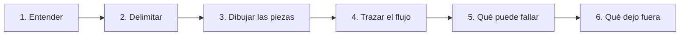
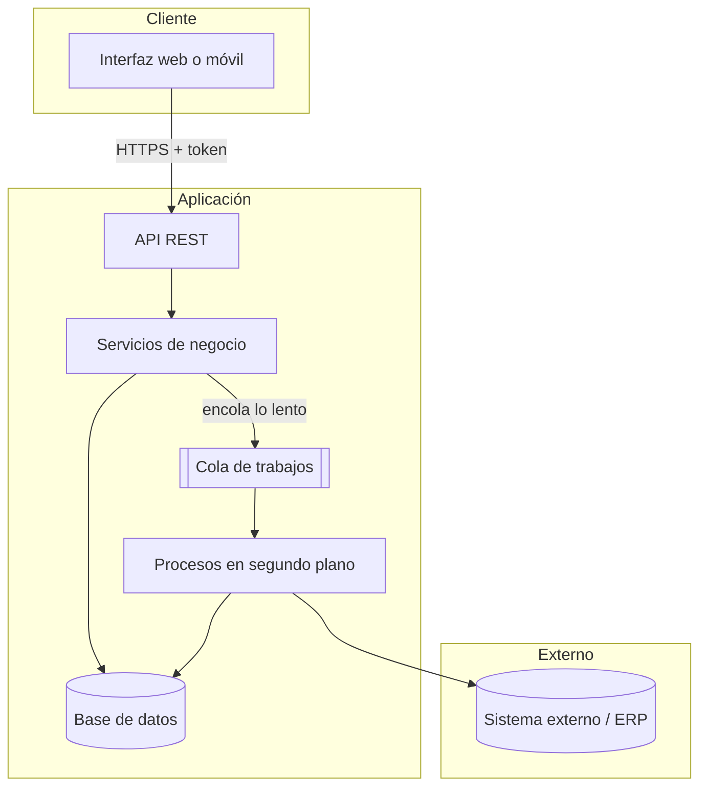

# Arquitectura { .section-fundamentos }

> Resolver un caso en la pizarra no es escribir código: es enseñar cómo piensas. Lo que se evalúa es si sabes hacer las preguntas correctas, separar responsabilidades y justificar por qué descartas una opción.

---

## Qué se evalúa {: .topic-title }

En una prueba de diseño en pizarra nadie espera sintaxis perfecta. Lo que se mira es otra cosa:

| Se valora | Se penaliza |
|---|---|
| Preguntar antes de dibujar | Empezar a dibujar sin entender el problema |
| Separar responsabilidades con claridad | Un cuadro gigante llamado "Backend" |
| Nombrar los datos y su flujo | Hablar solo de tecnologías |
| Reconocer qué puede fallar | Diseñar solo el camino feliz |
| Justificar por qué **no** eliges algo | Elegir lo más moderno sin motivo |
| Decir "no lo sé, lo comprobaría" | Inventarse una respuesta |

!!! tip "La respuesta más valorada suele ser una pregunta"
    Cuando te plantean un caso, la información está deliberadamente incompleta. Empezar a dibujar sin preguntar demuestra que asumes cosas; preguntar demuestra que sabes qué información falta.

    Preguntas que casi siempre aplican:

    - ¿Cuántos usuarios y cuántos datos? ¿Cien registros o diez millones?
    - ¿Con qué frecuencia cambia esto? ¿Vale un dato de hace cinco minutos?
    - ¿Qué pasa si el sistema externo no responde?
    - ¿Quién puede ver qué? ¿Los permisos dependen del rol o del dato?
    - ¿Esto ya existe de alguna forma, o partimos de cero?

---

## El método {: .topic-title }

Seis pasos, siempre en el mismo orden. Tenerlos memorizados evita quedarse en blanco delante de la pizarra.

**1 · Entender.** Repite el problema con tus palabras y pregunta lo que falte. No pases de aquí hasta que la otra persona asienta.

**2 · Delimitar.** Di en voz alta qué entra y qué no. "Asumo que la autenticación ya existe y me centro en el flujo de datos" es una frase que juega a tu favor.

**3 · Dibujar las piezas.** Cajas con nombre: cliente, API, base de datos, sistema externo, cola. Sin flechas todavía.

**4 · Trazar el flujo.** Ahora sí, siguiendo **un caso concreto** de principio a fin: "el usuario pulsa aquí, esto llama a esto, esto guarda aquí". Un solo recorrido, completo.

**5 · Qué puede fallar.** El paso que separa a un junior de un mid. Recorre las flechas y pregúntate qué pasa si cada una falla.

**6 · Qué dejo fuera.** Enumera lo que no has diseñado y por qué. Demuestra que lo has pensado, no que se te ha olvidado.

!!! warning "El paso 5 es el que casi nadie hace"
    La mayoría dibuja el camino feliz y para. Pero un sistema real pasa la mayor parte del tiempo gestionando lo que va mal: el servicio externo caído, la petición duplicada, el fichero corrupto, el usuario que cierra el navegador a mitad.

    Decir "aquí, si el ERP no responde, guardo la petición en una cola y reintento con espera creciente" vale más que cualquier diagrama bonito.

---

## Vocabulario para la pizarra {: .topic-title }

Términos que conviene usar bien, porque señalan que has visto el problema antes.

| Término | Qué significa | Dónde aparece |
|---|---|---|
| **Idempotente** | Repetir la operación no cambia el resultado | Reintentos, colas, webhooks |
| **Asíncrono** | El usuario no espera a que termine | Procesos largos, integraciones |
| **Cola de mensajes** | Trabajo pendiente que alguien procesa después | Desacoplar sistemas |
| **Caché** | Copia temporal para no repetir un trabajo caro | Datos que cambian poco |
| **Espera exponencial** | Reintentar esperando cada vez más | Servicios que fallan a ratos |
| **Cortocircuito** | Dejar de llamar a un servicio que está caído | Evitar el efecto dominó |
| **RBAC / ABAC** | Permisos por rol / por atributos del dato | Autorización |
| **Fuente de verdad** | Quién manda cuando dos sistemas discrepan | Sincronización de datos |
| **Cero cortes** | Desplegar sin interrumpir el servicio | Despliegue |

!!! danger "No uses una palabra que no puedas explicar"
    Si dices "aquí pondría un *event sourcing*" y te preguntan por qué, tienes que poder responder. Una palabra grande mal usada hace más daño que no decirla.

    Vale mucho más "aquí guardaría cada cambio como un registro aparte, para poder reconstruir el historial" que el nombre técnico sin comprensión detrás.

---

## Un esqueleto que sirve casi siempre {: .topic-title }

La mayoría de los casos de gestión encajan en esta forma. Empieza por aquí y adáptala.

Las tres ideas que transmite:

1. **El cliente solo habla con tu API**, nunca con el sistema externo ni con la base de datos.
2. **Lo lento no se hace durante la petición.** Se encola y se responde al usuario enseguida.
3. **El sistema externo está aislado** detrás de tus procesos, para que su caída no tire tu aplicación.

---

## Los cinco casos {: .topic-title }

Cinco enunciados del tipo que se plantea en una prueba de diseño, con el desarrollo paso a paso, lo que preguntarán después y los errores que descartan a un candidato.

| Caso | Concepto central |
|---------|----------|
| [01 - Autenticación y permisos](01-autenticacion-permisos/index.md) | Quién entra y qué puede tocar: RBAC frente a ABAC, sesiones y tokens |
| [02 - Integrar un sistema externo](02-integracion-externa/index.md) | Hablar con un ERP sin que su caída tumbe tu aplicación |
| [03 - Portal de cliente](03-portal-cliente/index.md) | Interfaz separada del backend: API, permisos por propietario, documentos |
| [04 - Asistente de IA sobre datos propios](04-asistente-ia/index.md) | Búsqueda por significado, contexto y límites de un modelo de lenguaje |
| [05 - Importación masiva](05-importacion-masiva/index.md) | Miles de registros sin bloquear nada: lotes, idempotencia, informe de errores |

---

## 📚 Fuentes {: .topic-title }

| Recurso | Link |
|---------|------|
| 🐘 **Symfony — Arquitectura y buenas prácticas** | https://symfony.com/doc/current/best_practices.html |
| 📗 **Martin Fowler — Patrones de arquitectura** | https://martinfowler.com/architecture/ |
| 📘 **MDN — HTTP** | https://developer.mozilla.org/es/docs/Web/HTTP |
