# Alineación en Flexbox { .section-flex }

> Una vez que los items están en el eje correcto, necesitás controlar **dónde** se colocan. Flexbox tiene propiedades específicas para el eje principal y el cruzado.

---

## Propiedades del contenedor

### Justify-content — Eje principal

Alinea los items a lo largo del **eje principal**.

```css
.contenedor {
    display: flex;
    justify-content: center;
}
```

| Valor | Efecto |
|-------|--------|
| `flex-start` | (default) Al inicio del eje |
| `flex-end` | Al final del eje |
| `center` | Centrados |
| `space-between` | Espacio igual entre items, primero y último pegados al borde |
| `space-around` | Espacio igual alrededor de cada item |
| `space-evenly` | Espacio idéntico entre todos (bordes incluidos) |


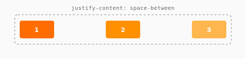

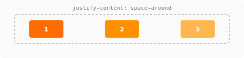


=== "space-between"
    ```
    │[A]──────[B]──────[C]│
    ```

=== "space-around"
    ```
    │──[A]──────[B]──────[C]──│
    ```

=== "space-evenly"
    ```
    │────[A]────[B]────[C]────│
    ```

!!! tip "Recordatorio visual" { .flex }
    Si `flex-direction: row` → `justify-content` mueve los items **horizontalmente**.  
    Si `flex-direction: column` → `justify-content` mueve los items **verticalmente**.  
    Es la propiedad del **eje principal**, siempre.

---

### Align-items — Eje cruzado

Alinea los items a lo largo del **eje cruzado** (perpendicular al principal).

```css
.contenedor {
    display: flex;
    align-items: center;
}
```

| Valor | Efecto |
|-------|--------|
| `stretch` | (default) Los items se estiran hasta llenar el contenedor |
| `flex-start` | Al inicio del eje cruzado |
| `flex-end` | Al final del eje cruzado |
| `center` | Centrados en el eje cruzado |
| `baseline` | Alineados por la línea base del texto |

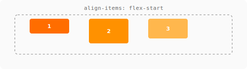

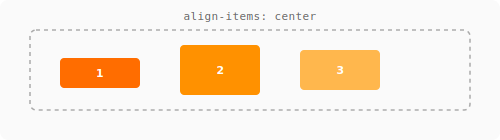

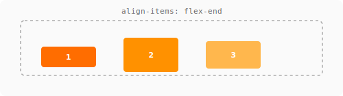

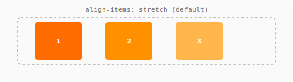

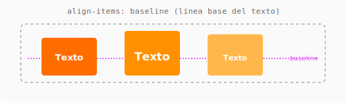

!!! warning "El error más común" { .flex }
    Ponés `align-items: center` y no centra horizontalmente → probablemente tenés `flex-direction: column`.  
    Recordá: en **column**, `align-items` controla el eje **horizontal** (el cruzado).

| `flex-direction` | `justify-content` | `align-items` |
|------------------|-------------------|---------------|
| `row` | Horizontal | Vertical |
| `column` | Vertical | Horizontal |

---

### Align-content — Eje cruzado (multilínea)

Solo funciona cuando hay **varias líneas** de items (con `flex-wrap: wrap`). Distribuye las líneas en el eje cruzado.

```css
.contenedor {
    display: flex;
    flex-wrap: wrap;
    align-content: center;  /* centra el bloque de líneas */
}
```

Acepta los mismos valores que `justify-content`: `flex-start`, `center`, `space-between`, etc.

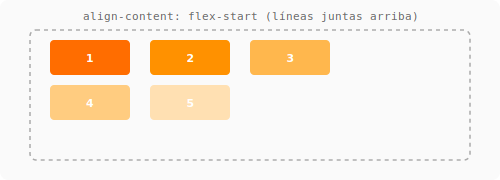

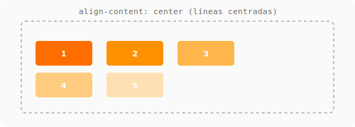

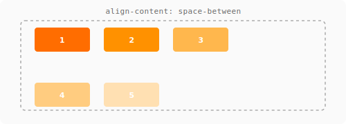

---

### Gap — Espaciado entre items

Separa los items sin depender de márgenes que rompen el layout.

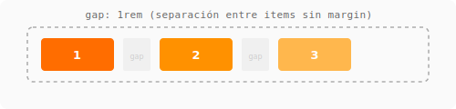

```css
.contenedor {
    display: flex;
    gap: 1rem;      /* separación horizontal y vertical */
    row-gap: 2rem;   /* separación vertical (si hay wrap) */
    column-gap: 1rem; /* separación horizontal */
}
```

!!! success "Siempre usá `gap`" { .flex }
    En vez de `margin` en los items hijos, usá `gap` en el contenedor. Evitás problemas con el primer/último item teniendo margen de más.

---

## Propiedades del item

### Align-self — Eje cruzado individual

Sobrescribe `align-items` para un item concreto.

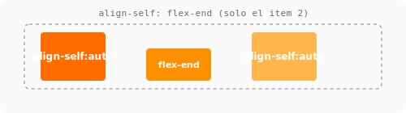

```css
.item-especial {
    align-self: flex-end;  /* este item va abajo, los otros no */
}
```

```css
/* Contenedor: todos centrados */
.contenedor { display: flex; align-items: center; }

/* Este item va al final */
.item { align-self: flex-end; }
```

!!! tip "Cuándo usarlo" { .flex }
    Cuando un item necesita una alineación **distinta** al resto. Ejemplo: botón "Comprar" en un card que siempre queda abajo mientras los otros items están centrados.

---

## Shorthand: Place-items

Aplica `align-items` y `justify-items` (no flexbox, pero útil):

```css
.contenedor {
    display: flex;
    place-items: center;  /* centra en ambos ejes */
}
```

Es equivalente a:
```css
.contenedor {
    align-items: center;
    justify-items: center; /* en flexbox, justify-items no aplica */
}
```

Para centrado perfecto en flexbox, usá:
```css
.contenedor {
    display: flex;
    justify-content: center;
    align-items: center;
}
```

---

## Referencias

- [MDN: Alinear items en flexbox](https://developer.mozilla.org/es/docs/Web/CSS/CSS_flexible_box_layout/Aligning_items_in_a_flex_container)
- [CSS-Tricks: Flexbox alignment](https://css-tricks.com/snippets/css/a-guide-to-flexbox/#aa-properties-for-the-parent-flex-container)
