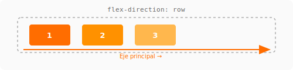
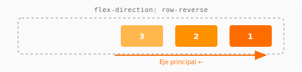
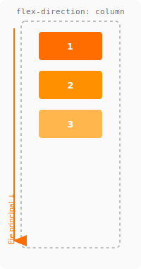
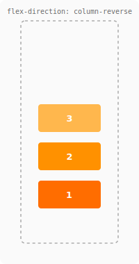
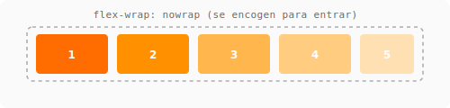
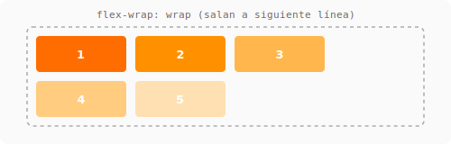
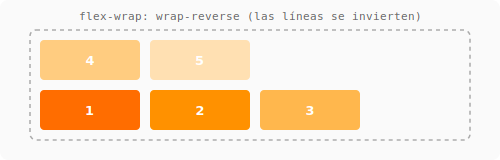

# Conceptos básicos de Flexbox { .section-flex }

---

## Display: Flex

Para activar Flexbox, el contenedor declara `display: flex`. Sus hijos directos se convierten en **items flexibles**.

```css
.contenedor {
    display: flex;
}
```

!!! tip "Analogía" { .flex }
    Pensá en Flexbox como un **estante**: el contenedor es la balda, los items son los objetos que ponés encima. Podés decidir si se ordenan de izquierda a derecha (`row`), de derecha a izquierda (`row-reverse`), de arriba a abajo (`column`), o al revés (`column-reverse`).

---

## Ejes

Flexbox tiene dos ejes:

| Eje | Dirección por defecto | Propiedad que lo controla |
|-----|----------------------|---------------------------|
| **Principal** | Horizontal (izquierda → derecha) | `flex-direction` |
| **Cruzado** | Vertical (arriba → abajo) | Perpendicular al principal |

En `flex-direction: row` (default), el eje principal es horizontal. En `column`, el principal es vertical, y el cruzado es horizontal.

```css
/* Por defecto */
.eje-row {
    flex-direction: row;       /* items en fila */
}

.eje-column {
    flex-direction: column;    /* items en columna */
}
```

!!! warning "No confundas" { .flex }
    `flex-direction: column` NO apila verticalmente con `justify-content: center` para centrar en el medio. En column, el **eje principal es vertical**, así que `justify-content: center` centra verticalmente y `align-items: center` centra horizontalmente. Al revés que en row.

---

## Flex-direction

Define la dirección del eje principal.

| Valor | Eje principal | Comportamiento |
|-------|---------------|----------------|
| `row` | → Horizontal | Items en fila, izquierda a derecha |
| `row-reverse` | ← Horizontal | Items en fila, derecha a izquierda |
| `column` | ↓ Vertical | Items en columna, arriba a abajo |
| `column-reverse` | ↑ Vertical | Items en columna, abajo a arriba |







=== "CSS"
    ```css
    .row { flex-direction: row; }
    .column { flex-direction: column; }
    ```

=== "HTML"
    ```html
    <div class="row">
        <div>Item 1</div>
        <div>Item 2</div>
        <div>Item 3</div>
    </div>
    ```

---

## Flex-wrap

Por defecto, los items se comprimen para entrar en una línea (`nowrap`). Con `flex-wrap: wrap`, los items saltan a la siguiente línea si no entran.

| Valor | Comportamiento |
|-------|----------------|
| `nowrap` | (default) Todos en una línea, se encogen si es necesario |
| `wrap` | Saltan a la siguiente línea cuando no caben |
| `wrap-reverse` | Saltan, pero en dirección opuesta |







```css
.contenedor {
    display: flex;
    flex-wrap: wrap;
    gap: 1rem;
}
```

!!! tip "El combo layout flexible" { .flex }
    `flex-wrap: wrap` + `flex: 1 1 200px` en los items te da un layout responsive **sin media queries**. Los items miden 200px, pero si hay espacio crecen (`flex-grow: 1`), y si no caben, saltan a la siguiente línea.

---

## Flex-flow

Shorthand de `flex-direction` + `flex-wrap`.

```css
.contenedor {
    flex-flow: row wrap;       /* dirección row, con wrap */
    flex-flow: column nowrap;  /* dirección column, sin wrap */
}
```

---

## Resumen visual

```
flex-direction: row (default)
┌──────────────────────────────────────────┐
│ [Item 1] [Item 2] [Item 3]               │
└──────────────────────────────────────────┘

flex-direction: column
┌──────────────────────────────────────────┐
│ [Item 1]                                 │
│ [Item 2]                                 │
│ [Item 3]                                 │
└──────────────────────────────────────────┘

flex-wrap: wrap (con items que no caben)
┌──────────────────────────────────────────┐
│ [Item 1] [Item 2] [Item 3] [Item 4]     │
│ [Item 5] [Item 6]                        │
└──────────────────────────────────────────┘
```

---

## Referencias

- [MDN: Conceptos básicos de Flexbox](https://developer.mozilla.org/es/docs/Web/CSS/CSS_flexible_box_layout/Basic_concepts_of_flexbox)
- [CSS-Tricks: Flexbox — the parent](https://css-tricks.com/snippets/css/a-guide-to-flexbox/#aa-parent-properties)
