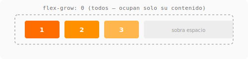
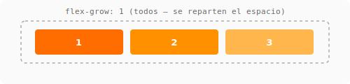
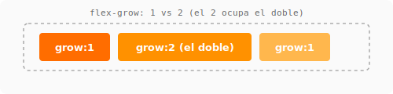
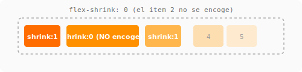
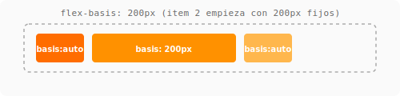
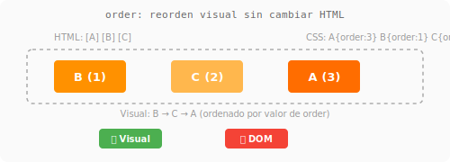

# Items flexibles { .section-flex }

> Lo que hace único a Flexbox es cómo los items pueden **crecer**, **encogerse** y **distribuirse** según el espacio disponible.

---

## Flex-grow — Factor de crecimiento

Controla cuánto **crece** un item respecto a los otros cuando sobra espacio.

- `0` (default): no crece, ocupa solo su contenido.
- `1`: ocupa el espacio sobrante equitativamente.
- `2`: ocupa el DOBLE de espacio que un item con `grow: 1`.







```css
.item { flex-grow: 1; }   /* todos se reparten el espacio */
.item-doble { flex-grow: 2; }  /* éste ocupa el doble */
```

=== "CSS"
    ```css
    .contenedor { display: flex; }
    .item { flex-grow: 1; padding: 1rem; }
    .item-doble { flex-grow: 2; }
    ```

=== "HTML"
    ```html
    <div class="contenedor">
        <div class="item">1</div>
        <div class="item-doble">2 (doble)</div>
        <div class="item">3</div>
    </div>
    ```

!!! tip "Sidebar + contenido" { .flex }
    ```css
    .sidebar { flex-grow: 0; flex-basis: 250px; }
    .contenido { flex-grow: 1; }
    ```
    El sidebar mide 250px fijo, y `.contenido` ocupa **todo lo que sobre**.

---

## Flex-shrink — Factor de encogimiento

Controla cuánto se **encoge** un item cuando **falta espacio**.

- `1` (default): se encoge si es necesario.
- `0`: NO se encoge nunca (se desborda o fuerza scroll).
- `2`: se encoge el doble que los demás.



```css
.item-no-compresible { flex-shrink: 0; }
```

!!! warning "`flex-shrink: 0` es aliado" { .flex }
    Si tenés una imagen o un botón que no debe deformarse, poné `flex-shrink: 0`. Así evitás que se comprima.

---

## Flex-basis — Tamaño base

Define el **tamaño inicial** de un item ANTES de aplicar grow o shrink.



- `auto` (default): usa el ancho del contenido o el `width` definido.
- valor fijo: `200px`, `50%`, `10rem`.

```css
.item { flex-basis: 200px; }  /* empieza con 200px */
```

Diferencia con `width`:
- En `flex-direction: row`, `flex-basis` reemplaza el ancho.
- En `flex-direction: column`, `flex-basis` reemplaza el alto.

```css
/* Son equivalentes en row: */
.item { width: 200px; }
.item { flex-basis: 200px; }      /* más flexible porque grow/shrink */

/* En column NO son equivalentes: */
.item { height: 200px; }          /* controla alto */
.item { flex-basis: 200px; }      /* en column, controla alto */
```

---

## Flex — Shorthand

Junta `flex-grow`, `flex-shrink` y `flex-basis` en una sola línea.

```css
flex: grow shrink basis;
```

| Valor shorthand | Equivalente | Efecto |
|----------------|-------------|--------|
| `flex: initial` | `0 1 auto` | (default) No crece, se encoge si falta espacio |
| `flex: auto` | `1 1 auto` | Crece y se encoge según el contenido base |
| `flex: 1` | `1 1 0%` | Crece equitativamente, todos parten de 0 |
| `flex: none` | `0 0 auto` | No crece ni se encoge, tamaño fijo |
| `flex: 2` | `2 1 0%` | Crece el doble, base 0 |

```css
/* Los más usados en producción: */
.item-flexible { flex: 1; }      /* reparto equitativo */
.item-fijo { flex: none; }       /* no se mueve */
.item-con-base { flex: 1 1 200px; } /* base 200px, crece si puede */
```

!!! tip "`flex: 1` es tu aliado" { .flex }
    Es el shorthand más usado: el item ocupa **todo el espacio disponible** partiendo de 0, compartiendo con otros items que tengan `flex: 1`.

---

## Order — Orden visual

Cambia el orden visual sin modificar el HTML.



```css
.item-ultimo { order: 2; }
.item-primero { order: -1; }
```

- Todos los items tienen `order: 0` por defecto.
- Se ordenan de menor a mayor.
- **No afecta** el orden del DOM (accesibilidad, tabulación).

```css
/* HTML: [A] [B] [C] */
.item-a { order: 3; }
.item-b { order: 1; }     /* visual: [C] [B] [A] */
.item-c { order: 2; }
```

!!! warning "`order` con cuidado" { .flex }
    Solo usar para ajustes visuales menores. No para cambiar el flujo de lectura. Si un elemento necesita estar antes en el orden visual pero después en DOM, reconsiderá el HTML.

---

## Guía rápida

| Quiero... | Uso |
|-----------|-----|
| Items del mismo ancho | `flex: 1` en todos |
| Item que ocupe el doble | `flex: 2` en ese item |
| Sidebar fijo + contenido elástico | Sidebar: `flex: none; width: 250px` — Contenido: `flex: 1` |
| Items que no se encojan | `flex-shrink: 0` |
| Un item al final | `margin-left: auto` (o flexbox con `justify-content: space-between`) |
| Reordenar sin tocar HTML | `order: -1` / `order: 1` |

---

## Referencias

- [MDN: Flex-grow, flex-shrink, flex-basis](https://developer.mozilla.org/es/docs/Web/CSS/flex)
- [CSS-Tricks: Flexbox — the children](https://css-tricks.com/snippets/css/a-guide-to-flexbox/#aa-properties-for-the-children-flex-items)
