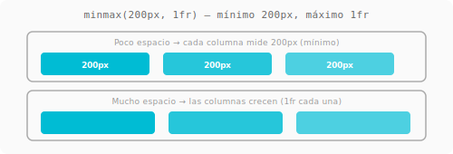
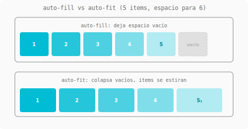
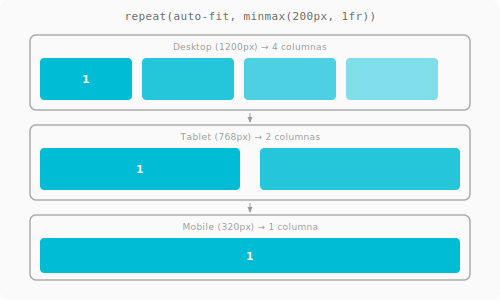
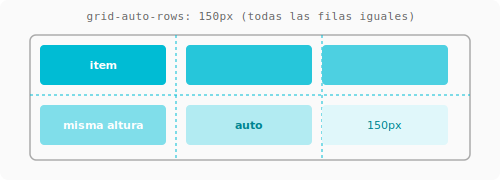

# Auto layout responsive con Grid { .section-grid }

> Lo mejor de Grid para maquetación real: layouts responsive **sin media queries** usando `auto-fill`, `auto-fit` y `minmax()`.

---

## Minmax()

Define un tamaño **mínimo** y **máximo** para las columnas.



```css
grid-template-columns: minmax(200px, 1fr);
/* mínimo 200px, máximo 1fr */
```

Cada columna mide al menos 200px, pero si hay espacio, crece hasta 1fr.

---

## Auto-fill y Auto-fit

Estas dos keywords hacen que Grid cree **tantas columnas como quepan** según el tamaño definido.

### Auto-fill

Crea columnas virtuales aunque no haya items para llenarlas.

```css
.galeria {
    display: grid;
    grid-template-columns: repeat(auto-fill, minmax(200px, 1fr));
    gap: 1rem;
}
```

```
Con 5 items y espacio para 6 columnas:
┌──────┐┌──────┐┌──────┐┌──────┐┌──────┐┌──────┐
│  1   ││  2   ││  3   ││  4   ││  5   ││ vacío│
└──────┘└──────┘└──────┘└──────┘└──────┘└──────┘
```

### Auto-fit

Idéntico a `auto-fill`, pero **colapsa las columnas vacías** y el contenido ocupa el espacio restante.

```css
.galeria {
    display: grid;
    grid-template-columns: repeat(auto-fit, minmax(200px, 1fr));
    gap: 1rem;
}
```

```
Con 5 items y espacio para 6 columnas:
┌──────┐┌──────┐┌──────┐┌──────┐┌──────────────┐
│  1   ││  2   ││  3   ││  4   ││      5       │
└──────┘└──────┘└──────┘└──────┘└──────────────┘
```

!!! tip "¿Cuál usar?" { .grid }
    **Casi siempre `auto-fit`.** A menos que necesites que cierta cantidad de columnas se mantenga aunque falten items (muy raro). Con `auto-fit` los items se estiran y no quedan huecos feos.



---

## El combo responsive sin media queries

```css
.galeria {
    display: grid;
    grid-template-columns: repeat(auto-fit, minmax(250px, 1fr));
    gap: 1rem;
}
```

| Pantalla | Columnas |
|----------|----------|
| 1200px | 4 columnas de 250px+ |
| 800px | 3 columnas |
| 550px | 2 columnas |
| 300px | 1 columna |

**0 media queries.** Solo CSS.



---

## Auto-rows

Controla el tamaño de las filas que se crean automáticamente.



```css
.contenedor {
    display: grid;
    grid-template-columns: repeat(auto-fit, minmax(200px, 1fr));
    grid-auto-rows: 250px;   /* todas las filas miden 250px */
    gap: 1rem;
}
```

Si querés que midan según el contenido, usá `auto` (default). Si querés que sean todas iguales, poné un valor fijo.

---

## Ejemplo completo: Galería responsive

=== "CSS"
    ```css
    .galeria {
        display: grid;
        grid-template-columns: repeat(auto-fit, minmax(250px, 1fr));
        gap: 1rem;
        padding: 1rem;
    }

    .card {
        display: flex;
        flex-direction: column;
        padding: 1rem;
        border: 1px solid #ddd;
        border-radius: 8px;
    }

    .card img {
        width: 100%;
        height: 200px;
        object-fit: cover;
        border-radius: 4px;
    }
    ```

=== "HTML"
    ```html
    <div class="galeria">
        <div class="card">
            
            <h3>Título</h3>
            <p>Descripción corta</p>
        </div>
        <!-- más cards... -->
    </div>
    ```

!!! success "El patrón definitivo" { .grid }
    `repeat(auto-fit, minmax(250px, 1fr))` es el patrón responsive que más vas a usar en tu vida. Memorizalo.

---

## Guía rápida

| Quiero... | Uso |
|-----------|-----|
| Columnas que se adaptan solas | `repeat(auto-fit, minmax(250px, 1fr))` |
| Filas del mismo alto | `grid-auto-rows: 200px` |
| Columna que no baje de X | `minmax(200px, 1fr)` |
| Galería responsive 0 media queries | El combo de arriba |

---

## Referencias

- [MDN: Auto-fill y auto-fit](https://developer.mozilla.org/es/docs/Web/CSS/repeat#auto-fill_vs_auto-fit)
- [CSS-Tricks: Auto-sizing columns](https://css-tricks.com/auto-sizing-columns-css-grid-auto-fill-vs-auto-fit/)
