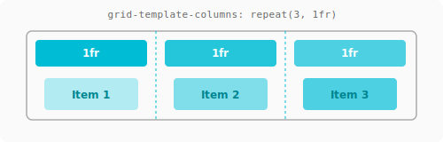
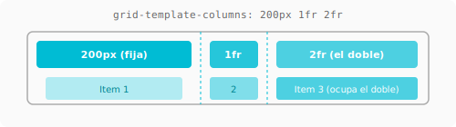

# Conceptos básicos de Grid { .section-grid }

---

## Display: Grid

```css
.contenedor {
    display: grid;
}
```

Los hijos directos se convierten en **items de grid**, pero a diferencia de flexbox, por defecto se apilan uno encima del otro (uno por celda). Necesitás definir las columnas.

---

## Grid-template-columns

Define el **número y tamaño de las columnas**.

```css
.contenedor {
    display: grid;
    grid-template-columns: 200px 1fr 1fr;
    /*    col1:200px    col2:flex    col3:flex    */
}
```

| Valor | Significado |
|-------|-------------|
| `200px` | Columna fija de 200px |
| `1fr` | Una fracción del espacio disponible |
| `2fr` | El doble de fracción que `1fr` |
| `auto` | Se ajusta al contenido |
| `repeat(3, 1fr)` | 3 columnas iguales |
| `minmax(200px, 1fr)` | Mínimo 200px, máximo 1fr |





=== "CSS"
    ```css
    /* 3 columnas: fija + flexible + flexible */
    .tres-columnas {
        display: grid;
        grid-template-columns: 200px 1fr 1fr;
        gap: 1rem;
    }
    ```

=== "HTML"
    ```html
    <div class="tres-columnas">
        <div>Sidebar</div>
        <div>Contenido</div>
        <div>Widgets</div>
    </div>
    ```

!!! tip "Unidad `fr`" { .grid }
    `fr` = fracción del espacio **disponible** (después de restar columnas fijas y gaps).  
    `grid-template-columns: 200px 1fr 1fr` significa: columna 1 de 200px, y el resto se divide en 2 partes iguales.

---

## Grid-template-rows

Define el tamaño de las filas.

```css
.contenedor {
    display: grid;
    grid-template-rows: 100px 1fr auto;
    /*    fila1:100px  fila2:flex  fila3:auto  */
}
```

Si no definís `grid-template-rows`, las filas se crean automáticamente con `auto` (se ajustan al contenido).

---

## Repeat()

Evitá escribir columnas repetitivas a mano.

```css
/* En vez de: */
grid-template-columns: 1fr 1fr 1fr 1fr;

/* Usá: */
grid-template-columns: repeat(4, 1fr);   /* 4 columnas iguales */
grid-template-columns: repeat(3, 200px); /* 3 columnas fijas de 200px */
grid-template-columns: 1fr repeat(2, 2fr) 1fr; /* mezclado */
```

---

## Gap — Espaciado

```css
.contenedor {
    display: grid;
    gap: 1rem;           /* filas y columnas */
    row-gap: 2rem;       /* solo filas */
    column-gap: 1rem;    /* solo columnas */
}
```

!!! success "Siempre `gap`" { .grid }
    Igual que en flexbox: nunca margenes en los hijos para separarlos. Usá `gap` en el contenedor.

---

## Layout básico con Grid

```css
.layout {
    display: grid;
    grid-template-columns: 250px 1fr;
    grid-template-rows: auto 1fr auto;
    min-height: 100vh;
    gap: 0;
}
```

```
┌──────────┬────────────────────────┐
│  HEADER  │      HEADER            │
├──────────┼────────────────────────┤
│ SIDEBAR  │      MAIN              │
│          │                        │
├──────────┼────────────────────────┤
│  FOOTER  │      FOOTER            │
└──────────┴────────────────────────┘
```

Pero esto es feo: header y footer debieran ocupar todo el ancho. Para eso necesitás **grid-template-areas** (lo vemos en la [siguiente página](ubicacion.md)).

---

## Diferencia clave con Flexbox

```css
/* FLEXBOX — una fila, los items se estiran */
.contenedor { display: flex; }

/* GRID — columnas y filas explícitas */
.contenedor {
    display: grid;
    grid-template-columns: repeat(3, 1fr);
}
```

| Flexbox | Grid |
|---------|------|
| Los items se empujan | Los items ocupan celdas |
| No sabés cuántas columnas hay hasta que wrappean | Vos definís las columnas |
| Ideal para componentes | Ideal para layouts completos |

---

## Referencias

- [MDN: Conceptos básicos de Grid](https://developer.mozilla.org/es/docs/Web/CSS/CSS_grid_layout/Basic_concepts_of_grid_layout)
- [CSS-Tricks: Grid — the parent](https://css-tricks.com/snippets/css/complete-guide-grid/#aa-grid-container)
