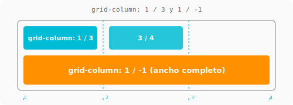
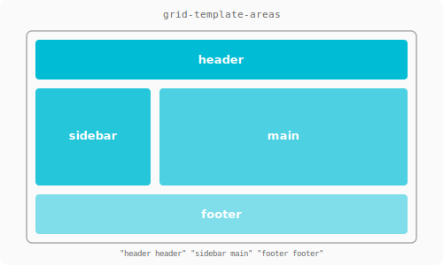
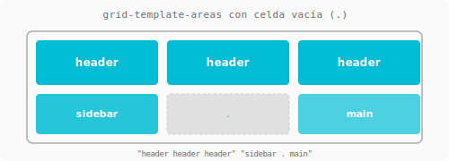
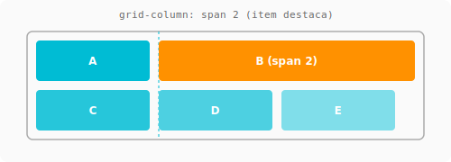

# Ubicación y áreas en Grid { .section-grid }

> Esto es lo que hace a Grid **realmente poderoso**: podés decidir dónde empieza y termina cada item, creando layouts que con flexbox serían imposibles o muy rebuscados.

---

## Grid-column / Grid-row

Controlan desde qué línea hasta qué línea ocupa un item.

```css
.item-header {
    grid-column: 1 / -1;  /* ocupa desde línea 1 hasta la última */
}

.item-sidebar {
    grid-column: 1 / 2;   /* ocupa de línea 1 a línea 2 (columna 1) */
    grid-row: 2 / 4;      /* ocupa de fila 2 a fila 4 (2 filas) */
}
```

=== "CSS"
    ```css
    .layout {
        display: grid;
        grid-template-columns: 250px 1fr;
        grid-template-rows: auto 1fr auto;
        min-height: 100vh;
    }
    .header  { grid-column: 1 / -1; }         /* toda la fila de arriba */
    .sidebar { grid-column: 1 / 2; }           /* columna izquierda */
    .main    { grid-column: 2 / 3; }           /* columna derecha */
    .footer  { grid-column: 1 / -1; }          /* toda la fila de abajo */
    ```

=== "HTML"
    ```html
    <div class="layout">
        <header class="header">Header</header>
        <aside class="sidebar">Sidebar</aside>
        <main class="main">Contenido</main>
        <footer class="footer">Footer</footer>
    </div>
    ```

!!! tip "Líneas negativas" { .grid }
    `-1` es siempre la **última línea** del grid. `1 / -1` significa "de la primera a la última línea", equivalente a "ocupa todo el ancho".



---

## Grid-template-areas

La forma más LEGIBLE de definir layouts. Asignás nombres a las áreas y después los items los usan.

```css
.layout {
    display: grid;
    grid-template-columns: 250px 1fr;
    grid-template-rows: auto 1fr auto;
    grid-template-areas:
        "header  header"
        "sidebar main"
        "footer  footer";
    min-height: 100vh;
}

.header  { grid-area: header; }
.sidebar { grid-area: sidebar; }
.main    { grid-area: main; }
.footer  { grid-area: footer; }
```



Cada fila se escribe entre comillas, cada celda es un nombre de área. El punto (`.`) indica celda vacía.



```css
grid-template-areas:
    "header  header  header"
    "sidebar .       main"
    "footer  footer  footer";
```

!!! warning "Consistencia" { .grid }
    Cada área debe formar un **rectángulo contiguo**. No podés tener áreas en L o separadas — es HTML+CSS, no TETRIS.

---

## Responsive con áreas

Cambiando `grid-template-areas` en media queries, reordenás todo sin tocar HTML.

=== "Desktop"
    ```css
    .layout {
        grid-template-columns: 250px 1fr;
        grid-template-areas:
            "header  header"
            "sidebar main"
            "footer  footer";
    }
    ```

=== "Mobile"
    ```css
    @media (max-width: 768px) {
        .layout {
            grid-template-columns: 1fr;
            grid-template-areas:
                "header"
                "main"
                "sidebar"
                "footer";
        }
    }
    ```

!!! success "El poder real de Grid" { .grid }
    Con `grid-template-areas` cambiás **completamente** el layout en mobile con solo 5 líneas CSS. Sin tocar el HTML. Eso es imposible con flexbox puro.

---

## Grid-column / Grid-row con span

```css
.item-destacado {
    grid-column: span 2;  /* ocupa 2 columnas */
    grid-row: span 2;     /* ocupa 2 filas */
}
```



```
┌─────┬─────┬─────┐
│  A  │  B  │  C  │
├─────┼─────┼─────┤
│  D  │  🟩 DESTACADO  │
├─────┼─────┴─────┤
│  F  │  G        │
└─────┴───────────┘
```

Útil para galerías donde un item es más grande que los otros.

---

## Guía rápida

| Quiero... | Uso |
|-----------|-----|
| Un item que ocupe todo el ancho | `grid-column: 1 / -1` |
| Sidebar + contenido | `grid-template-columns: 250px 1fr` |
| Layout legible y fácil de cambiar | `grid-template-areas` |
| Un item doble de ancho | `grid-column: span 2` |
| Reordenar en mobile | Cambiar `grid-template-areas` en media query |

---

## Referencias

- [MDN: Grid-template-areas](https://developer.mozilla.org/es/docs/Web/CSS/grid-template-areas)
- [CSS-Tricks: Grid areas](https://css-tricks.com/snippets/css/complete-guide-grid/#aa-grid-container-properties)
