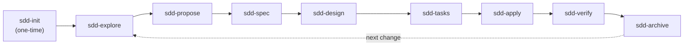

# Fases de SDD — Detalle

Esta página expande el resumen de [SDD](index.md). Acá se detalla cada fase, el artefacto que produce, quién la ejecuta y cómo se aplica concretamente a codeLearn.

---

## Diagrama de dependencias (DAG)

!!! note "sdd-init es one-time"
    La fase de inicio se ejecuta una sola vez por proyecto. Su objetivo es dejar el repositorio listo para aplicar SDD; después de eso, el ciclo principal va de `explore` a `archive`.

---

## Las 9 fases

### sdd-init

- **Objetivo**: Preparar el proyecto para trabajar con SDD de forma reproducible.
- **Artifact que produce**: `openspec/config.yaml`, la estructura de carpetas `openspec/{specs,changes,changes/archive}` y el registro de habilidades del proyecto.
- **Duración estimada**: 1 vez por proyecto.
- **Quién ejecuta**: Orchestrator o agente de setup.
- **Dependencias**: Ninguna.
- **Ejemplo codeLearn**: Configurar `openspec/config.yaml` de codeLearn y asegurar que existan las carpetas para cambios y especificaciones.

!!! tip "Hacelo una sola vez"
    No repitas `sdd-init` en cada cambio. Una vez configurado, el proyecto ya está listo para iterar sobre el ciclo principal.

### sdd-explore

- **Objetivo**: Investigar el código existente y entender el contexto antes de proponer un cambio.
- **Artifact que produce**: `openspec/changes/{change-name}/exploration.md` (opcional) o notas de contexto en Engram.
- **Duración estimada**: 5–10 min.
- **Quién ejecuta**: Orchestrator delega en el sub-agente explore.
- **Dependencias**: `sdd-init` completado.
- **Ejemplo codeLearn**: Antes de documentar las fases SDD, revisar `docs/sdd/index.md` y `mkdocs.yml` para entender la estructura actual del sitio.

!!! tip "Todavía no se codea"
    En esta fase solo se recolecta contexto. Si aparece código, probablemente te estés apurando.

### sdd-propose

- **Objetivo**: Definir **qué** cambio se va a hacer y **por qué**.
- **Artifact que produce**: `openspec/changes/{change-name}/proposal.md` con la intención, el alcance, los riesgos y el plan de rollback.
- **Duración estimada**: 5–10 min.
- **Quién ejecuta**: Orchestrator o sub-agente propose.
- **Dependencias**: `sdd-explore`.
- **Ejemplo codeLearn**: Proponer "Crear documentación de fases SDD" porque la página de índice ya enlaza `fases.md` y falta el contenido detallado.

!!! tip "La intención primero"
    Si no puedes escribir el problema en una oración, todavía no entiendes el cambio.

### sdd-spec

- **Objetivo**: Escribir requisitos detallados con escenarios concretos.
- **Artifact que produce**: `openspec/changes/{change-name}/specs/{domain}/spec.md`.
- **Duración estimada**: 10–15 min.
- **Quién ejecuta**: Orchestrator o sub-agente spec.
- **Dependencias**: `sdd-propose`.
- **Ejemplo codeLearn**: Especificar que `docs/sdd/fases.md` debe incluir las 9 fases, un diagrama Mermaid y una tabla de mapeo contra las fases de la empresa.

!!! tip "Criterio de aceptación visible"
    Usá Given/When/Then para los escenarios. Si no hay criterio de aceptación, no hay spec.

### sdd-design

- **Objetivo**: Decidir **cómo** se implementa técnicamente el cambio.
- **Artifact que produce**: `openspec/changes/{change-name}/design.md` con decisiones de arquitectura, tradeoffs y plan de pruebas.
- **Duración estimada**: 10–15 min.
- **Quién ejecuta**: Orchestrator o sub-agente design.
- **Dependencias**: `sdd-spec`.
- **Ejemplo codeLearn**: Decidir agregar `custom_fences` a `pymdownx.superfences` en `mkdocs.yml` en lugar de usar un script inline, para respetar las reglas de estilo del proyecto.

!!! tip "Documentá el porqué"
    Dentro de tres meses no vas a recordar por qué elegiste una opción sobre otra. El design.md es tu memoria técnica.

### sdd-tasks

- **Objetivo**: Dividir el cambio en tareas atómicas y secuenciales.
- **Artifact que produce**: `openspec/changes/{change-name}/tasks.md`.
- **Duración estimada**: 5 min.
- **Quién ejecuta**: Orchestrator o sub-agente tasks.
- **Dependencias**: `sdd-design`.
- **Ejemplo codeLearn**: T1 configurar Mermaid en `mkdocs.yml`; T2 crear `docs/sdd/fases.md`; T2.1–T2.7 completar el detalle de contenido.

!!! tip "Tareas pequeñas"
    Cada tarea debería ser lo suficientemente chica como para completarse en una sesión de trabajo.

### sdd-apply

- **Objetivo**: Implementar las tareas una por una siguiendo las specs y el design.
- **Artifact que produce**: Código y documentación modificados en el workspace; `tasks.md` actualizado con `[x]`.
- **Duración estimada**: La que lleve.
- **Quién ejecuta**: Sub-agente apply (executor).
- **Dependencias**: `sdd-tasks` completado; todas las tareas deben estar definidas antes de empezar.
- **Ejemplo codeLearn**: Modificar `mkdocs.yml`, escribir `docs/sdd/fases.md` y ejecutar `mkdocs build` para verificar.

!!! tip "Seguí el design"
    Si encontrás un error en el design, anotalo en el reporte de apply. No improvises una solución distinta sin dejar constancia.

### sdd-verify

- **Objetivo**: Validar que la implementación cumple con las especificaciones.
- **Artifact que produce**: `openspec/changes/{change-name}/verify-report.md`.
- **Duración estimada**: 5–10 min.
- **Quién ejecuta**: Sub-agente verify.
- **Dependencias**: `sdd-apply`.
- **Ejemplo codeLearn**: Confirmar que `mkdocs build` no arroja errores, que el diagrama Mermaid se renderiza y que cada fase tiene los 6 campos requeridos.

!!! tip "Verificá contra la spec"
    El criterio de éxito no es "funciona como yo esperaba", sino "funciona como dice la spec".

### sdd-archive

- **Objetivo**: Cerrar el cambio, guardar lo aprendido y actualizar las especificaciones maestras.
- **Artifact que produce**: Carpeta movida a `openspec/changes/archive/YYYY-MM-DD-{change-name}/` y specs maestras actualizadas.
- **Duración estimada**: 5 min.
- **Quién ejecuta**: Orchestrator o sub-agente archive.
- **Dependencias**: `sdd-verify`.
- **Ejemplo codeLearn**: Mover `openspec/changes/fases-sdd/` a `openspec/changes/archive/2026-06-27-fases-sdd/` y fusionar el delta en `openspec/specs/sdd/fases.md`.

!!! tip "El aprendizaje es el artefacto más valioso"
    No dejes lo aprendido solo en el chat. El archive es lo que le da memoria al proyecto.

---

## Mapeo SDD ↔ Fases de la empresa

!!! warning "Mapeo v1 — preliminar"
    Esta tabla es una primera aproximación. Pau debe validarla contra el workflow real de 13 fases de su empresa.

| Fase SDD | Fase(s) empresa | Notas |
|----------|-----------------|-------|
| **sdd-init** | Configuración del proyecto | Setup one-time del repositorio. |
| **sdd-explore** | Descubrimiento / Discovery | Entender el código y el contexto de negocio. |
| **sdd-propose** | PRD | Definir qué se hace y por qué. |
| **sdd-spec** | Definición de requisitos | Detallar criterios de aceptación. |
| **sdd-design** | Diseño UX/UI, Arquitectura técnica | Decidir la solución visual y técnica. |
| **sdd-tasks** | Planning / Estimación | Dividir el trabajo en tareas ejecutables. |
| **sdd-apply** | Desarrollo, Code review | Implementar y revisar el código. |
| **sdd-verify** | QA / Testing / UAT | Validar que todo funciona según lo especificado. |
| **sdd-archive** | Deploy, Release, Post-mortem | Liberar y documentar lecciones aprendidas. |

---

## Recursos adicionales

!!! info "Lecturas recomendadas"
    - [Repositorio gentle-ai](https://github.com/Gentleman-Programming/gentle-ai) — Arquitectura IA orquestada con metodología SDD.
    - [Repositorio Engram](https://github.com/gentleman-programming/engram) — Memoria persistente entre sesiones.
    - [OpenSpec](https://openspec.dev) — Framework ligero de desarrollo guiado por especificaciones.
