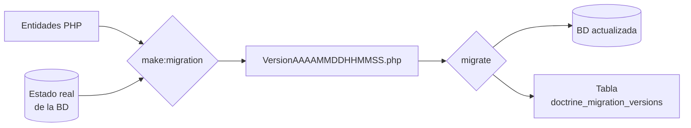

# Doctrine — Migraciones { .section-fundamentos }

> Las entidades describen cómo **debería** ser la base de datos; la base de datos real es otra cosa. Una migración es el fichero que lleva de una a la otra, versionado en el repositorio, para que el mismo cambio se aplique igual en tu máquina, en la de un compañero y en producción.

---

## Instalar y comandos {: .topic-title }

```bash
composer require doctrine/doctrine-migrations-bundle
```

| Comando | Qué hace |
|---|---|
| `symfony console make:migration` | Compara entidades con la BD y **genera** el fichero |
| `symfony console doctrine:migrations:migrate` | **Ejecuta** las migraciones pendientes |
| `symfony console doctrine:migrations:status` | Cuáles se han aplicado y cuáles faltan |
| `symfony console doctrine:migrations:list` | Lista todas con su estado |

Dos pasos separados a propósito: primero se genera, **se lee**, y luego se ejecuta.

## Cómo funciona {: .topic-title }



Doctrine guarda en la tabla `doctrine_migration_versions` **qué migraciones ya se han ejecutado**. Al lanzar `migrate`, aplica solo las que faltan, en orden. Por eso el mismo comando es seguro en cualquier entorno: hace lo que haga falta y nada más.

## El fichero generado {: .topic-title }

```php
final class Version20260906143012 extends AbstractMigration
{
    public function getDescription(): string
    {
        return 'Añade el índice de listado de pedidos por cliente y fecha';
    }

    public function up(Schema $schema): void
    {
        $this->addSql('CREATE INDEX idx_pedido_cliente_fecha ON pedido (cliente_id, fecha)');
    }

    public function down(Schema $schema): void
    {
        $this->addSql('DROP INDEX idx_pedido_cliente_fecha');
    }
}
```

`up()` aplica el cambio, `down()` lo deshace. El nombre lleva la marca de tiempo, y eso fija el orden.

!!! danger "Lee siempre la migración generada antes de ejecutarla"
    `make:migration` genera SQL a partir de una comparación automática, y a veces se equivoca en lo que más duele:

    - Renombrar una propiedad se detecta como **`DROP COLUMN` + `ADD COLUMN`**: la columna nueva nace vacía y **los datos de la vieja se pierden**. Un `RENAME COLUMN` a mano conserva todo.
    - Puede incluir cambios que no esperabas, arrastrados de una entidad que tocó otra persona.
    - En bases de datos grandes, un `ALTER TABLE` puede bloquear la tabla varios minutos.

    El fichero es tuyo: se puede y se debe editar antes de aplicarlo.

!!! tip "Rellena `getDescription()`"
    Dentro de seis meses, `Version20260906143012` no dice nada. La descripción aparece en `migrations:list` y convierte una lista de números en un historial legible.

## `make:migration` frente a `schema:update` {: .topic-title }

Existe un atajo que aplica los cambios directamente, sin fichero:

```bash
symfony console doctrine:schema:update --force
```

!!! danger "`schema:update --force` no se usa fuera de una prueba desechable"
    Tres motivos, y los tres son graves:

    1. **No deja rastro.** No hay fichero, no hay historial, y no hay forma de que un compañero replique el cambio.
    2. **No se puede deshacer.** No existe un `down()`.
    3. **Borra sin preguntar.** Si una columna ya no está en la entidad, la elimina con todos sus datos.

    En producción **nunca**. En desarrollo, solo cuando estás prototipando un esquema que vas a tirar.

## Datos, no solo estructura {: .topic-title }

Una migración también puede transformar datos, y a veces es imprescindible:

```php
public function up(Schema $schema): void
{
    // 1. columna nueva, permitiendo null de momento
    $this->addSql('ALTER TABLE pedido ADD estado VARCHAR(20) DEFAULT NULL');

    // 2. rellenar las filas existentes
    $this->addSql("UPDATE pedido SET estado = 'confirmado' WHERE enviado = true");
    $this->addSql("UPDATE pedido SET estado = 'pendiente' WHERE enviado = false");

    // 3. ahora ya se puede exigir
    $this->addSql('ALTER TABLE pedido ALTER COLUMN estado SET NOT NULL');
}
```

!!! warning "Una columna `NOT NULL` en una tabla con filas falla siempre"
    No hay valor para las filas que ya existen, y la base de datos rechaza el `ALTER`. El patrón es el de arriba, en tres pasos: **crear permitiendo nulos → rellenar → exigir**.

    Es el fallo de migración más frecuente y el que más se repite al añadir un campo obligatorio a algo que ya está en producción.

!!! tip "Para datos de prueba, fixtures; para datos de negocio, migración"
    Los datos de ejemplo con los que trabajas en local van en `doctrine/doctrine-fixtures-bundle`, no en una migración. La migración es para transformaciones que **tienen que ocurrir en todos los entornos**, producción incluida.

## En el despliegue {: .topic-title }

```bash
composer install --no-dev --optimize-autoloader
symfony console doctrine:migrations:migrate --no-interaction
symfony console cache:clear
symfony console messenger:stop-workers
```

!!! warning "El orden importa: la migración antes de que el código nuevo reciba tráfico"
    Si el código nuevo se activa antes de que la columna exista, cada petición revienta hasta que la migración termina. Con despliegues sin corte, el patrón es hacer los cambios **compatibles hacia atrás**: primero añadir sin quitar, desplegar, y eliminar lo viejo en una migración posterior.

!!! danger "Copia de seguridad antes de migrar en producción"
    Un `down()` no siempre puede devolver los datos: un `DROP COLUMN` es irreversible por mucho `down()` que escribas, porque el contenido ya no existe. La red de seguridad real es la copia previa, no el método de reversión.

---

## 📚 Fuentes {: .topic-title }

| Fuente | Enlace |
|---|---|
| 📘 **Symfony — Bases de datos y Doctrine** | [symfony.com/doc/current/doctrine.html](https://symfony.com/doc/current/doctrine.html) |
| 📘 **DoctrineMigrationsBundle** | [symfony.com/bundles/DoctrineMigrationsBundle/current/index.html](https://symfony.com/bundles/DoctrineMigrationsBundle/current/index.html) |
