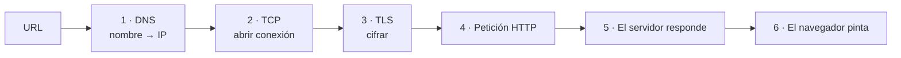

# Petición y respuesta { .section-web }

> Entre pulsar Intro en la barra del navegador y ver la página pasan cinco o seis cosas distintas, cada una con su propia forma de fallar. Saber cuáles son convierte un «la web no carga» en un diagnóstico concreto.

---

## Qué ocurre al escribir una URL { .topic-title }



**1. DNS.** `www.ejemplo.com` no significa nada para la red: hace falta una dirección IP. El navegador pregunta a un servidor de nombres y recibe algo como `93.184.216.34`. Se cachea, por eso un cambio de DNS tarda en propagarse.

**2. TCP.** Se abre una conexión con esa IP en un puerto —el 80 para HTTP, el 443 para HTTPS—. Es un ida y vuelta previo antes de poder mandar nada.

**3. TLS.** Con HTTPS se negocia el cifrado y se valida el certificado del servidor. Otro ida y vuelta. A partir de aquí, lo que viaja va cifrado de extremo a extremo.

**4. La petición.** El navegador manda un texto con el método, la ruta, las cabeceras y, si hay, un cuerpo.

**5. La respuesta.** El servidor devuelve un código de estado, cabeceras y el cuerpo.

**6. El render.** El navegador interpreta el HTML, descubre que necesita CSS, JS e imágenes, y lanza **más peticiones** para cada uno. La página que ves son decenas de ciclos como este.

!!! tip "Cada paso falla de forma distinta"
    | Síntoma | Dónde está el problema |
    |---|---|
    | `DNS_PROBE_FINISHED_NXDOMAIN` | Paso 1: el nombre no resuelve |
    | `ERR_CONNECTION_REFUSED` | Paso 2: hay IP, pero nada escuchando en ese puerto |
    | `ERR_CERT_*` | Paso 3: certificado caducado o mal emitido |
    | Un código `4xx` o `5xx` | Paso 5: llegaste al servidor y te contestó |

    Distinguirlos ahorra horas. Un `502` significa que tu servidor **sí** existe y respondió; un `ERR_CONNECTION_REFUSED` significa que ni siquiera llegaste.

## Anatomía de una petición { .topic-title }

```http
POST /api/pedidos HTTP/1.1
Host: ejemplo.com
Content-Type: application/json
Authorization: Bearer eyJhbGciOi...
Accept: application/json

{"producto": "A1", "cantidad": 3}
```

Cuatro partes: **línea inicial** (método, ruta, versión), **cabeceras**, una **línea en blanco**, y el **cuerpo** opcional.

## Anatomía de una respuesta { .topic-title }

```http
HTTP/1.1 201 Created
Content-Type: application/json
Location: /api/pedidos/4471
Cache-Control: no-store

{"id": 4471, "estado": "recibido"}
```

La misma estructura, con un **código de estado** en lugar de un método.

## HTTP no tiene memoria { .topic-title }

Cada petición es independiente. El servidor atiende, responde y olvida: no sabe que la petición anterior vino del mismo navegador.

Toda la sensación de continuidad —estar logueado, tener un carrito— se construye encima, con **cookies** que el navegador reenvía en cada petición o con un **token** que se manda en la cabecera `Authorization`.

!!! info "Que no tenga estado es una decisión de diseño, no una carencia"
    Es lo que permite que cualquier servidor de una granja atienda cualquier petición sin coordinarse con los demás. Si el servidor guardase el estado de cada usuario en memoria, no podrías poner tres servidores detrás de un balanceador sin que la sesión se perdiera al saltar de uno a otro.

## Qué es un origen { .topic-title }

Un **origen** son tres cosas juntas: **esquema + dominio + puerto**.

| URL | ¿Mismo origen que `https://app.com/a`? |
|---|---|
| `https://app.com/b` | ✅ solo cambia la ruta |
| `http://app.com/a` | ❌ esquema distinto |
| `https://api.app.com/a` | ❌ subdominio distinto |
| `https://app.com:8443/a` | ❌ puerto distinto |

Este concepto es la base de casi toda la seguridad del navegador —y de [CORS](../04-cors/index.md)—, así que conviene tenerlo exacto: un subdominio **no** es el mismo origen.

## Las versiones del protocolo { .topic-title }

| Versión | Aporta |
|---|---|
| **HTTP/1.1** | Una petición cada vez por conexión: si una tarda, bloquea a las siguientes |
| **HTTP/2** | Varias peticiones en paralelo sobre una sola conexión, cabeceras comprimidas |
| **HTTP/3** | Sobre UDP en lugar de TCP: se recupera mejor de la pérdida de paquetes |

!!! tip "HTTP/2 invalida un truco antiguo"
    Con HTTP/1.1 era buena práctica **juntar** todo el CSS en un fichero y las imágenes en un *sprite*, porque cada petición extra costaba una conexión. Con HTTP/2 varias peticiones viajan en paralelo por la misma conexión y esa optimización deja de compensar — incluso perjudica, porque un solo fichero enorme invalida la caché entera al cambiar una línea.

    Es un ejemplo de por qué conviene saber en qué versión estás antes de aplicar consejos de rendimiento encontrados por ahí.

---

## 📚 Fuentes { .topic-title }

| Fuente | Enlace |
|---|---|
| 📗 **MDN — Generalidades del protocolo HTTP** | [developer.mozilla.org/es/docs/Web/HTTP/Overview](https://developer.mozilla.org/es/docs/Web/HTTP/Overview) |
| 📗 **MDN — Evolución de HTTP** | [developer.mozilla.org/es/docs/Web/HTTP/Basics_of_HTTP/Evolution_of_HTTP](https://developer.mozilla.org/es/docs/Web/HTTP/Basics_of_HTTP/Evolution_of_HTTP) |
