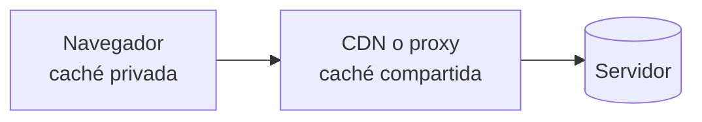

# Caché HTTP { .section-web }

> La petición más rápida es la que no se hace. La caché HTTP es el mecanismo con el que un servidor le dice al navegador, al proxy y al CDN cuánto tiempo pueden reutilizar una respuesta sin volver a preguntar. Bien puesta, no se nota; mal puesta, los usuarios ven una versión vieja durante semanas.

---

## Quién cachea { .topic-title }



Hay dos naturalezas distintas y confundirlas tiene consecuencias:

- **Caché privada** — la del navegador de una persona. Puede guardar contenido personalizado.
- **Caché compartida** — CDN, proxy corporativo. La usan **muchos usuarios**, así que jamás debe guardar nada personal.

## `Cache-Control` { .topic-title }

La cabecera que lo gobierna todo. Se combinan varias directivas separadas por comas.

| Directiva | Qué significa |
|---|---|
| `max-age=3600` | Válida 3600 segundos sin volver a preguntar |
| `s-maxage=86400` | Igual, pero solo para cachés **compartidas** |
| `public` | Puede guardarla cualquier caché |
| `private` | **Solo el navegador**, nunca un CDN |
| `no-cache` | Puede guardarla, pero **debe revalidar** antes de usarla |
| `no-store` | **No la guardes en ningún sitio** |
| `must-revalidate` | Al caducar, no sirvas la vieja: pregunta |
| `immutable` | No va a cambiar nunca; ni preguntes |

!!! danger "`no-cache` no significa «no caches»"
    Es el nombre peor elegido del protocolo.

    - **`no-cache`** → «guárdala, pero **pregúntame** antes de servirla». Sigue habiendo caché, con revalidación.
    - **`no-store`** → «**no la guardes**». Es la que de verdad desactiva la caché.

    Para una respuesta con datos personales o bancarios, la correcta es `no-store`.

## Validación: `ETag` y `304` { .topic-title }

Cuando una respuesta caduca, el navegador no tiene por qué descargarla entera otra vez: puede preguntar si ha cambiado.

```http
# Primera vez, el servidor manda una "huella" de la versión
HTTP/1.1 200 OK
ETag: "a1b2c3"
Cache-Control: max-age=60
```

```http
# Al caducar, el navegador pregunta con esa huella
GET /api/pedidos HTTP/1.1
If-None-Match: "a1b2c3"
```

```http
# Si no ha cambiado: respuesta vacía y baratísima
HTTP/1.1 304 Not Modified
```

Un `304` **no lleva cuerpo**. Ahorra el ancho de banda entero, aunque el viaje de ida y vuelta sigue ocurriendo.

`Last-Modified` + `If-Modified-Since` hacen lo mismo con una fecha, con menos precisión: no distingue dos cambios dentro del mismo segundo, y un fichero regenerado sin cambios de contenido cambia de fecha. `ETag` es preferible.

## La estrategia que se usa en la práctica { .topic-title }

| Tipo de recurso | Cabecera | Por qué |
|---|---|---|
| **Estáticos con hash en el nombre** (`app.4f8c2a.js`) | `Cache-Control: public, max-age=31536000, immutable` | El nombre cambia si cambia el contenido |
| **HTML** | `Cache-Control: no-cache` | Corto y siempre revalidado: es quien apunta a los estáticos |
| **API pública** | `Cache-Control: public, max-age=60` | Un minuto de desfase es aceptable |
| **API con datos del usuario** | `Cache-Control: private, no-store` | Nunca en una caché compartida |

!!! tip "El hash en el nombre resuelve la invalidación"
    Es el patrón central del despliegue moderno. Si el fichero se llama `app.4f8c2a.js` y cambias una línea, el compilador genera `app.9d1e7b.js`. El HTML —que no se cachea— apunta al nombre nuevo, y el navegador lo descarga porque **es otra URL**.

    Así puedes cachear los estáticos un año entero sin miedo: nunca hace falta invalidar nada, porque nada se sobrescribe.

!!! danger "Cachear HTML de forma agresiva es la trampa clásica"
    Con `max-age=86400` en el HTML, un usuario que visitó ayer **no verá el despliegue de hoy** — y no hay forma de forzarlo desde el servidor: su navegador ni siquiera pregunta. Y no basta con arreglarlo: los que ya recibieron esa cabecera seguirán sin preguntar hasta que caduque.

    El HTML es el punto de entrada. Va con `no-cache` para que siempre revalide.

## `Vary`: cuando la respuesta depende de una cabecera { .topic-title }

```http
Vary: Accept-Encoding, Accept-Language
```

Le dice a la caché que la respuesta **cambia según esas cabeceras**, así que debe guardar una copia por cada combinación.

!!! danger "Sin `Vary`, un CDN puede servir la respuesta equivocada"
    Si tu API devuelve JSON o HTML según el `Accept`, y no declaras `Vary: Accept`, la caché compartida guarda **la primera respuesta que pase** y se la sirve a todos. El siguiente usuario recibe HTML donde esperaba JSON.

    Lo mismo con el idioma. Y **nunca** pongas `Vary: Cookie` con contenido cacheable en compartida: como cada usuario tiene una cookie distinta, la caché se vuelve inútil y, si se configura mal, puede filtrar la respuesta de un usuario a otro.

## Caché de la aplicación, otra capa { .topic-title }

Todo lo anterior es caché **de HTTP**: evita que la petición llegue o que el cuerpo se descargue. Hay otra capa distinta, dentro del servidor, que evita **recalcular** la respuesta: guardar el resultado de una consulta pesada en Redis, por ejemplo.

Son complementarias y resuelven cosas distintas. En Symfony la primera se configura con cabeceras en la respuesta; la segunda, con el componente Cache.

---

## 📚 Fuentes { .topic-title }

| Fuente | Enlace |
|---|---|
| 📗 **MDN — Caché HTTP** | [developer.mozilla.org/es/docs/Web/HTTP/Caching](https://developer.mozilla.org/es/docs/Web/HTTP/Caching) |
| ⚡ **web.dev — Estrategias de caché** | [web.dev/articles/http-cache](https://web.dev/articles/http-cache) |
