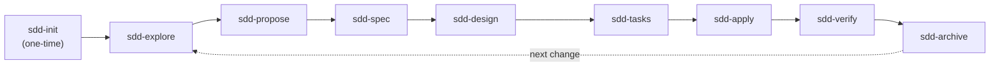

# Design: fases-sdd

## Technical Approach

Single documentation page (`docs/sdd/fases.md`) that expands the phase summary table from `docs/sdd/index.md` into a detailed reference. Content in Spanish, structured for MkDocs Material with Mermaid diagrams and admonitions. No code changes — purely educational content.

## Architecture Decisions

### Decision: Mermaid rendering strategy

| Option | Tradeoff | Decision |
|--------|----------|----------|
| Add `custom_fences` to `pymdownx.superfences` in `mkdocs.yml` | Requires modifying an existing file (out of scope per proposal) | **Chosen** — prerequisite for diagrams to render |
| Use inline `<script>` with mermaid.js CDN | Works without config but violates "no inline CSS/JS" spirit | Rejected |
| Replace Mermaid with ASCII art in code blocks | Zero config needed, but loses visual quality | Rejected — spec requires Mermaid |

**Rationale**: `pymdownx.superfences` is already enabled but lacks `custom_fences` for mermaid. Without it, ` ```mermaid ` blocks render as plain code. The `mkdocs.yml` modification is a one-time config addition (~4 lines) and is a hard prerequisite. This should be treated as a separate task or a noted exception to the "no modificar archivos existentes" constraint.

### Decision: Page structure — sequential phases vs grouped

| Option | Tradeoff | Decision |
|--------|----------|----------|
| One `##` section per phase (9 sections) | Long page but scannable via TOC; matches spec requirement | **Chosen** |
| Group phases into stages (Setup / Define / Build / Close) | Shorter sections but adds abstraction layer not in SDD | Rejected |

**Rationale**: The spec requires each phase to have objective, artifact, duration, executor, example, and dependencies. One section per phase keeps this uniform and lets the TOC (toc_depth: 4 in mkdocs.yml) serve as navigation.

### Decision: Company mapping as separate section

| Option | Tradeoff | Decision |
|--------|----------|----------|
| Mapping table at the end, after all phases | Clean separation; phases stand alone | **Chosen** |
| Mapping inline within each phase section | Couples two concerns; harder to update | Rejected |

**Rationale**: The company mapping is labeled "v1 / mapeo preliminar" and will evolve independently from phase definitions. Keeping it separate reduces coupling.

## Page Structure

```
# Fases de SDD — Detalle

## Introducción (2-3 líneas)
   Contexto: para qué sirve esta página, link de vuelta a index.md

## Diagrama de dependencias (DAG)
   Mermaid flowchart: init → explore → propose → spec → design → tasks → apply → verify → archive
   !!! note "init es one-time" admonition

## Las 9 fases (## por cada fase)
   Para cada fase:
   - **Objetivo**: una frase
   - **Artifact que produce**: nombre del archivo/resultado
   - **Duración estimada**: rango
   - **Quién ejecuta**: orchestrator → sub-agent
   - **Dependencias**: qué fase(s) deben estar completas
   - **Ejemplo codeLearn**: escenario real del repo
   !!! tip o !!! warning donde aplique

## Mapeo SDD ↔ Fases de la empresa
   Tabla: Fase SDD | Fase(s) empresa | Notas
   !!! warning "Mapeo v1 — preliminar"

## Recursos adicionales
   Links: gentle-ai, Engram, OpenSpec
```

## Admonitions Plan

| Type | Where | Purpose |
|------|-------|---------|
| `!!! note` | After DAG diagram | Clarify `sdd-init` is one-time setup |
| `!!! tip` | Per-phase sections (selective) | Practical advice for each phase |
| `!!! warning` | Company mapping section | Label as "v1 — mapeo preliminar" |
| `!!! info` | Resources section | Point to external references |

## Mermaid Diagram



## File Changes

| File | Action | Description |
|------|--------|-------------|
| `docs/sdd/fases.md` | Create | Main deliverable — detailed phase documentation |
| `mkdocs.yml` | Modify | Add `custom_fences` for Mermaid rendering (prerequisite) |

### mkdocs.yml Change Detail

Replace:
```yaml
- pymdownx.superfences
```

With:
```yaml
- pymdownx.superfences:
    custom_fences:
      - name: mermaid
        class: mermaid
        format: !!python/name:pymdownx.superfences.fence_code_format
```

## Testing Strategy

| Layer | What to Test | Approach |
|-------|-------------|----------|
| Build | `mkdocs build` succeeds without errors | Run build, check for warnings |
| Render | Mermaid diagram displays correctly | Visual check in browser |
| Render | Admonitions display with proper styling | Visual check in browser |
| Links | Internal links to `index.md` resolve | Click-through verification |
| Content | Phase order matches `index.md` table | Manual comparison |
| Content | All 9 phases have required fields | Checklist against spec |

## Migration / Rollout

No migration required. Single file creation. Rollback: delete `docs/sdd/fases.md` and revert `mkdocs.yml` custom_fences addition.

## Open Questions

- [ ] Should the `mkdocs.yml` Mermaid config change be a separate task, or bundled with this change? (Recommendation: bundle — it's 4 lines and a hard prerequisite)
- [ ] Company 13-phase mapping: Pau needs to validate the mapping. Should we ship with placeholder values or wait for input?
